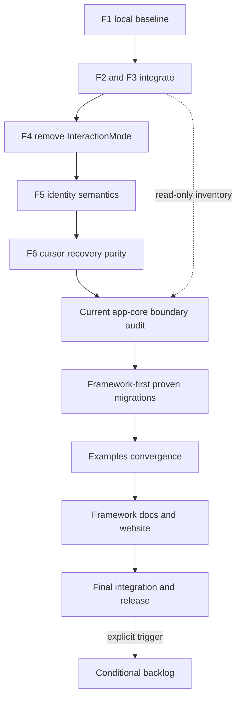

## Context

- 2026-08-28 代码事实：superproject `62aa76e` 仍指向发布基线 `echo-agent@9f8d723`、`echo-agent-cli@e7d9e90`、`echo-website@c25c86d`；F0 已在 CLI `main/origin@f48beca`，F1 为 framework `9bbca5e` 与 CLI `20e7584`，F2/F3 均从 `20e7584` 并行开发且尚未完成提交门禁。
- 现有计划分散在顶层、子仓库、历史 Git 提交、`.claude/plans`、`.zcode/plans` 和 comprehensive-review 台账。状态字段多处早于当前代码，不能继续直接作为实施授权。
- 旧 app-core 边界审计约覆盖 50 个模块；当前 `echo-agent-app-core/src` 已有 149 个 Rust 文件。framework 当前有 64 个 Rust examples 和 90 份中英文公共文档，现有门禁尚未证明其语义全部与最新 facade、模式删除和产品边界一致。
- 本文件是剩余工作的程序级路线和切片门禁，不是一次性 Build 输入。每个可独立合并、独立验证、独立停止的阶段必须在开始生产修改前提升为同主题下一序号 Supreme plan。

## Approach

- 以代码、测试、当前 worktree 和远端可达提交为事实源；旧计划只作为假设输入，逐项归类为 `Completed`、`Active`、`Queued`、`Conditional`、`Rejected` 或 `Superseded`。
- 先关闭正在运行的 F2/F3 并冻结干净集成基线，再串行完成 F4、F5、F6。只有交互、任务和 surface authority 稳定后，才进行当前 app-core 全量边界复审和 framework-first 迁移，避免围绕变化中的 API 重复返工。
- 原 F7 拆成三个可审计部分：旧路径与架构边界收敛、examples/docs/website 收敛、最终集成发布。长时与大规模门禁只在全部功能和架构修改结束后运行一次。
- 当前 F2/F3 期间只允许并行做 R0 的只读 inventory；不得提前执行 app-core 下沉、mode 删除、examples/docs 生产改写或最终 soak。
- 跨仓能力遵循 framework producer first、EKO adapter second、被替代路径同阶段删除；拿不准的能力留应用层，直到当前代码证明存在通用复用价值。

## Global Constraints

- `echo-agent` 与 `echo-agent-cli` 只使用 Subagent 术语；不得新增或保留内部平行角色术语。
- EKO 不启用 SQLite；framework 的合理 SQLite 公共实现不因 EKO 不调用而删除。
- 单一 authority：一个 turn driver、一个 receipt lifecycle、一个 Task graph/revision/validator/ready frontier、一个 Conversation Agent router、一个 exact-attempt Subagent control owner。
- 不新增第二 runtime、mailbox、store、DAG loop、status reducer、plan validator、自由文本地址解析器或 mode 替身。
- `InteractionMode` 必须删除，不得改名为 `ExecutionStyle`、`RouteMode` 或其它同义决策输入。
- framework 只接收通用机制；workspace、DomainProfile、review/worktree、文件权威、UI/TUI/CLI/channel 投影继续归 EKO。
- 所有字符串预览 UTF-8 安全；生产、测试、examples 和文档代码不得使用无证明的 `unwrap`、`expect`、直接索引、字节切片或 panic 宏。
- 跨仓提交保持相对 Cargo path；framework commit 先于依赖它的 CLI commit；child commit 远端可达后才能更新 superproject gitlink。
- 当前 CLI `main` 有既有未提交改动，协调合流必须使用独立 integration worktree，不得覆盖或吸收来源不明的主工作树修改。
- 本计划不授权 push、merge、publish、gitlink 更新、清理 worktree 或长时 soak；对应动作在最终阶段仍需明确授权。

## Files

- Modify: `echo-agent-cli/echo-agent-app-core/src/tasks/task_runtime/types.rs` — F2 canonical Task execution/status authority。
- Create: `echo-agent-cli/echo-agent-app-core/src/agent_control.rs` — F3 两类 target 的薄控制 adapter。
- Create: `echo-agent-cli/docs/adr/0015-task-graph-status-authority.md` — F2 架构决策。
- Create: `echo-agent-cli/docs/adr/0016-agent-control-tools.md` — F3 ADR 在合流时从冲突的 `0015` 重编号。
- Modify: `echo-agent-cli/echo-agent-app-core/src/tool_exposure.rs` — 删除 mode 驱动工具可见性。
- Modify: `echo-agent-cli/echo-agent-app-core/src/types/request.rs` — 删除 mode wire contract。
- Modify: `echo-agent-cli/src/cli/repl.rs` — 删除 CLI mode 路径并保持统一 admission。
- Modify: `echo-agent-cli/web-frontend/src/components/chat/ChatInput.tsx` — 删除 GUI mode 控件。
- Modify: `echo-agent-cli/echo-agent-app-core/src/agent_router.rs` — Conversation Agent 精确地址和 receipt owner。
- Modify: `echo-agent-cli/echo-agent-app-core/src/tasks/task_runtime/subagent_control.rs` — attempt-scoped Subagent 控制。
- Modify: `echo-agent-cli/echo-agent-app-core/src/chat_event_log.rs` — cursor/restart receipt 投影。
- Modify: `echo-agent-cli/echo-agent-app-core/src/surface_contract.rs` — GUI/TUI/CLI/JSONL/channel 对等合同。
- Create: `docs/2026-08-28-current-framework-application-boundary-audit.md` — 当前 149 文件的边界与重复性审计。
- Modify: `docs/MASTER-PLAN.md` — 只保留最新断点、前向路线和历史计划处置结论。
- Modify: `echo-agent-cli/docs/architecture.md` — 记录实际 EKO authority 与薄 adapter。
- Modify: `echo-agent/src/lib.rs` — 仅导出 R0 证明需要下沉的通用能力。
- Modify: `echo-agent-cli/echo-agent-app-core/src/lib.rs` — 切换 framework API 并删除被替代的应用实现。
- Modify: `echo-agent/Cargo.toml` — examples feature/target 和 consumer gate。
- Modify: `echo-agent/echo-agent-learning/examples/README.md` — 64 个 examples 的保留、迁移、删除和 prerequisites 清单。
- Modify: `echo-agent/echo-agent-learning/src/bin/facade_consumer.rs` — 扩展真实 facade-only consumer probes。
- Modify: `echo-agent/echo-agent-learning/tests/documentation_contract.rs` — examples/docs/facade 可执行合同。
- Modify: `echo-agent/docs/en/README.md` — 英文公共文档索引和范围。
- Modify: `echo-agent/docs/zh/README.md` — 中文公共文档索引和范围。
- Modify: `echo-website/docs-sync-manifest.json` — framework/EKO 文档 revision 与 hash。
- Modify: `echo-agent/.github/workflows/rust-ci.yml` — framework 最终 CI 门禁。
- Modify: `echo-agent-cli/.github/workflows/rust-ci.yml` — EKO Rust/frontend 最终 CI 门禁。
- Modify: `echo-website/.github/workflows/ci.yml` — website 最终门禁。

## Reuse

- `docs/2026-08-26-agent-interaction-convergence-plan.md` — F2-F7 行为合同、依赖 DAG 和完成定义。
- `docs/2026-08-26-extension-control-final-integration-unified-plan.md` — 已完成 release A/B、最终 CI/soak 延期边界。
- `echo-agent/echo-orchestration/src/tasks/runtime_executor.rs` — `RuntimeDagExecutor` 唯一 DAG 内核。
- `echo-agent/echo-orchestration/src/tasks/revisioned.rs` — `RevisionedTaskStore`、revision CAS 和 task tools authority。
- `echo-agent/src/runtime.rs` 与 `echo-agent/echo-state/src/journal/` — turn driver、journal、checkpoint 和 cursor 原语。
- `echo-agent-cli/echo-agent-app-core/src/agent_router.rs` — durable Conversation Agent mailbox、groups 和 cold/live delivery。
- `echo-agent-cli/echo-agent-app-core/src/tasks/task_runtime/subagent_control.rs` — exact attempt guidance/interrupt authority。
- `echo-agent-cli/echo-agent-app-core/src/tasks/task_runtime/run_authority.rs` — EKO journal-derived read model。
- `echo-agent/echo-agent-learning/tests/documentation_contract.rs` — 当前 link/facade 文档门禁，后续扩展而非另造脚本。
- `echo-website/scripts/sync-docs.mjs` — website 文档同步与 manifest authority。
- `echo-agent/scripts/verify.sh` 与三个仓库现有 CI workflow — 复用既有门禁，不新建平行验证入口。

## Current Baseline And Disposition

| 主题 | 当前结论 | 后续动作 |
| --- | --- | --- |
| Release A/B 与 website 同步 | Completed；发布基线 `9f8d723/e7d9e90/c25c86d` 与顶层 gitlink 已完成 | 不重复执行 |
| F0 characterization | Completed；CLI `f48beca` 已在 `main/origin` | 作为 F2/F3 回归输入 |
| F1 receipt/admission | Code complete；framework `9bbca5e`、CLI `20e7584` 本地未发布 | 随 F2/F3 集成后统一冻结，不单独返工 |
| F2 Task/Plan/Todo authority | Active；当前测试仍有直接相关失败，generated DTO 变更由 F2 owner 持有 | 完成专项修复、完整门禁与独立 review |
| F3 Agent control tools | Active；主实现已落地，focused compile/duplicate exact-once 尚未完成 | 完成专项门禁与独立 review |
| F4-F6 | Queued | 按本计划依赖顺序逐阶段提升为新 plan |
| 原 F7 | Superseded by decomposition | 分解为 R0-R4 与 Final Gate |
| Public Framework Boundary、Task kernel、三类 file store migration | Completed | 保留能力，R0 只审新代码和实际残余 |
| 2026-07 app-core 约 50 模块审计 | Superseded | 当前 149 文件重新审计 |
| comprehensive-review framework 294 finding | Completed | 不重新打开；只有当前代码回归证据才重开 owner |
| cross-quality 59 个 pending 行 | Stale ledger, not 59 active defects | R0/F7 依据当前代码逐项归档，不直接排成 59 个任务 |
| `.claude/plans`、`.zcode/plans`、旧 superpowers plans | Historical/Superseded | 不作为执行入口 |
| Runtime Reliability、Long Horizon | Feature complete | 只保留 Final Gate 长时与人工 GUI 验收 |
| SkillsHub upstream sync、外部专业工具、Hosted Service 等 | Conditional | 仅满足触发条件后单独立项 |

## Program Roadmap

| 阶段 | 依赖 | 可并行范围 | 退出门 |
| --- | --- | --- | --- |
| P0 F2/F3 合流与基线冻结 | F1 `20e7584`、framework `9bbca5e` | F2 与 F3 独立 worktree；coordinator 独占 ADR 编号、generated snapshot、Cargo.lock、合流 | 两 lane 全绿、双 review 通过、集成分支完整门禁通过、干净 SHA 冻结 |
| P1 F4 删除 InteractionMode | P0 | 只允许 renderer fixture 准备；mode 生产删除单 owner | `rg InteractionMode` 与 generated DTO 为零；普通 chat 不建 TaskRun；task tools 显式建图 |
| P2 F5 Agent/Subagent 生命周期 | P1 | Conversation 与 TaskSubagent 测试 fixture 可分 lane，identity 类型单 owner | 长期 Conversation 多 turn；stale attempt 永不影响新 attempt；graph/message receipt 正交 |
| P3 F6 cursor/recovery/surface parity | P2 | surface renderer 可并行，journal/cursor/recovery 单 owner | cursor 无重复、restart 可恢复、五入口同 fixture、无 stranded receipt/handle |
| R0 当前边界审计 | P3 的冻结 SHA；只读 inventory 可提前 | framework/app/examples/docs 三个只读 inventory 可并行 | 149 个 app-core 文件逐项分类；每个候选有定义/注册/可达/复用证据；无模糊迁移项 |
| R1 framework-first 通用能力迁移 | R0 | 不同 framework crate 可并行；同一 public facade/Cargo.lock 单 owner | framework API 先绿；EKO adapter 无损切换；被替代实现删除；无第二 authority |
| R2 examples 收敛 | R1 稳定 public facade | inventory/分类可提前；Cargo targets 与 consumer crate 单 owner | 64 个 example 均有 disposition；保留项可编译；panic/UTF-8 禁用扫描为零；facade-only probe 全绿 |
| R3 framework docs/website 收敛 | P1、R1、R2 | 中英文页面可按文件 owner 并行；索引/manifest 单 owner | 公共 API、feature、examples、双语、website hash 同步；无 EKO authority 冒充 framework |
| G Final Integration/Release | P0-P3、R0-R3 | 三仓门禁可按磁盘容量串行；远端 CI 与文档核查可并行 | 全门禁、fault matrix、10k/100k、10m/1h/2h、人工 GUI、远端 CI、child-first push/gitlinks 全部通过 |

## Todos

### integrate-f2-f3-baseline

requirements:
- 用户要求：基于最新代码统一所有未完成项，执行链不重复、不回头。
- `docs/2026-08-26-agent-interaction-convergence-plan.md` 的 Iteration 2、Iteration 3 与并行 owner 约束。
- `AGENTS.md` 的 framework-first、单一任务权威、文档/示例同步与提交门禁。

interfaces:
- consumes: framework `9bbca5e`、CLI F1 `20e7584`、F2/F3 独立 worktree 的最终本地 commits 和验证证据。
- produces: 一个干净的 CLI 集成 SHA、唯一 ADR 编号、唯一 generated DTO snapshot、F4 冻结基线和未遗留重复清单。

steps:

1. 等待 F2、F3 分别完成专项修复、适用门禁和独立只读 review；禁止 coordinator 在 lane 未完成时修改其代码。
   verify: 两个 lane 都报告干净工作树、commit、执行命令、通过计数和遗留重复为零或有明确终止阶段。
   expected: F2 不再以 TodoStatus 驱动 runtime；F3 只复用 AgentRouter/SubagentControlService，没有新 runtime/store。
2. 从 `20e7584` 建 coordinator integration worktree，按 owner 复核并合入 F2/F3；F2 ADR 保留 `0015`，F3 ADR 重编号为 `0016`；generated DTO 只从集成后的 Rust 真理源生成一次。
   verify: `git diff --check` 通过，ADR 编号唯一，Cargo path 全为相对路径，主 checkout 的既有修改哈希不变。
   expected: 合流没有覆盖用户工作树，也没有把 lane-local generated 噪声当作第二 authority。
3. 执行 echo-agent-cli 适用提交门禁、GUI 条件矩阵和 frontend 门禁；任何失败都在集成分支修复并重新 review。
   verify: `cargo fmt --all -- --check`、两套 clippy、workspace tests、app-core no-default、GUI check/test、Prettier、frontend tests/build 全部退出 0。
   expected: 获得可供 F4 使用的精确、干净、本地冻结 SHA；不 push、不更新 gitlink。

### remove-interaction-mode

requirements:
- 用户明确要求：完成权威迁移后删除 Chat/Task/Auto mode，禁止改名保留替身。
- 交互收敛计划 Iteration 4 和完成定义。

interfaces:
- consumes: P0 冻结 SHA、F2 canonical Task graph、F3 explicit agent/task tools、invocation capability snapshot。
- produces: 无 `InteractionMode` 的 Rust/IPC/generated TS/GUI/TUI/CLI/channel/persistence/prompt 路径。

steps:

1. 先切换工具可见性、run admission 和路由诊断到 registered tools、DomainProfile、workspace resource、explicit TaskRun binding 和 observed facts。
   verify: 相同 invocation 在五入口得到相同 capability snapshot；普通对话不产生 TaskRun；`task_create` 后可显式执行。
   expected: 删除 mode 前新 authority 已真实承接生产调用，期间不建立双路由。
2. 删除 surface 控件、CLI `/mode`、channel/TUI 状态、wire DTO、prompt 分支、持久字段、默认值和解析器。
   verify: 全仓 `rg` 对 `InteractionMode`、`InteractionModeRequest`、`requested_mode` 的生产引用为零。
   expected: 不存在 `ExecutionStyle`、`RouteMode` 或字符串模式替身。
3. 更新本阶段所属 EKO ADR、architecture、features 和 surface contracts，完成适用门禁和独立 review。
   verify: tool schema budget、provider prompt snapshots、五入口合同和完整 CLI/frontend 门禁全绿。
   expected: F5 获得无 mode 的干净冻结 SHA。

### settle-agent-lifecycle-recovery

requirements:
- 交互收敛计划 Iteration 5、Iteration 6。
- 用户要求 GUI/TUI/CLI/JSONL/channel 功能完全对等。

interfaces:
- consumes: 无 mode 基线、F1 tracked receipts、F3 two-target agent control service。
- produces: 长期 Conversation Agent、attempt-scoped Task Subagent、统一 cursor wait、boot reconciliation 和五入口 typed parity。

steps:

1. 固定 ConversationTarget 多 turn/follow-up 与 TaskSubagentTarget exact attempt 的不同生命周期；late/stale message fail closed，task revision 只能由 `task_update(base_revision)` 改变。
   verify: 多 turn conversation、stale attempt、wrong revision/generation、duplicate command 和 follow-up 不改图的 characterization 全绿。
   expected: Conversation completion、Subagent terminal、Task completion 不再共享模糊 `completed` 语义。
2. 统一 AgentRouter/TaskRuntime cursor wait，覆盖 timeout、cancel、needs-attention、terminal、restart cursor、workspace switch/delete 和 cold/unloaded address。
   verify: cursor 重启后不重投已确认 terminal；boot reconciliation 覆盖 receipt 未完成组合；bounded probe 无 stranded owner。
   expected: wait 不依赖高频 list polling，不拥有任务终态。
3. 让 GUI/TUI/CLI/JSONL/channel 共用同一 app-core service 和 fixture，删除 surface-local 地址、队列、恢复和状态推断。
   verify: 五入口 parity matrix、fault matrix、Rust/GUI/frontend 门禁全绿；本阶段不运行长时 soak。
   expected: R0 获得稳定且无 surface 旁路的应用边界。

### reaudit-current-boundary

requirements:
- 用户要求：根据最新代码整体 review 架构，不继续沿用散落的旧计划。
- `AGENTS.md` 的实现前分层判定、全仓重复搜索和框架公共 API 删除标准。

interfaces:
- consumes: P3 冻结 SHA、旧 `35f1d83` app-core 审计作为历史假设、当前 149 文件 inventory、framework facade 和所有生产 composition roots。
- produces: `docs/2026-08-28-current-framework-application-boundary-audit.md`，逐项给出 `generic/application/adapter`、定义/注册/可达性、迁移/保留/删除处置和精确 owner。

steps:

1. 枚举 app-core、CLI/Tauri/TUI/channel、framework crates、examples/docs 的定义、注册、composition root 和生产调用；对新增模块逐文件审查，不接受旧 docstring 作为证据。
   verify: 149 个 app-core Rust 文件均有唯一分类，所有公开 framework 候选完成合理复用方判断。
   expected: 没有因“CLI 未调用”误删 framework API，也没有因“以后可能通用”保留应用重复实现。
2. 对每个迁移候选证明 framework 已有原语或至少两个合理复用场景；列出 app policy、薄 adapter、round-trip 字段和同阶段删除目标。
   verify: 每个 `migrate` 行都有当前定义、真实 caller、目标 API、consumer cutover、删除路径和验收；证据不足项归 `keep` 或 `conditional`。
   expected: R1 不需要重新做架构发现，也不会新增抽象后保留旧主路径。
3. 更新顶层 MASTER-PLAN 当前断点并归档旧计划 disposition；正式 framework/EKO 行为仍写回所属子仓库文档。
   verify: 顶层只保留跨仓阶段材料，child docs 仍是产品/API 长期事实源，旧 pending 台账不再被解释为活任务。
   expected: 后续每个独立迁移候选可提升为单独 Supreme plan。

### migrate-proven-framework-capabilities

requirements:
- R0 审计中处置为 `migrate` 的候选。
- 用户要求：高效、尽可能复用、禁止重复和回头。

interfaces:
- consumes: R0 每个候选的现有 authority、目标 framework API、字段级 adapter 和删除清单。
- produces: framework-first 公共能力、EKO 薄 adapter、无损 round-trip 测试和被替代代码删除。

steps:

1. 每个可独立交付候选单独创建后续 plan；framework commit 先实现通用机制并通过其 workspace、feature、examples 和 docs 门禁。
   verify: 新 API 不含 EKO workspace/UI/DomainProfile/review/worktree 字段，至少一个 framework test 或 facade consumer 使用真实 API。
   expected: framework 能力独立于 CLI 编译和使用。
2. CLI 后续 plan 切换至少一条真实生产路径，adapter 只做类型转换、metadata/policy 注入和投影；同阶段删除旧实现与调用点。
   verify: round-trip 字段无损；旧定义/注册/可达引用为零；没有第二 store/loop/reducer。
   expected: 每个迁移切片独立正确，后续计划停止也不会留下永久双实现。
3. 跨仓每次迁移同步 ADR、examples、framework docs、EKO docs 和 website 适用性判断。
   verify: 两仓适用门禁全绿，path hygiene 通过，提交说明明确 website/examples 是否适用。
   expected: R2 只面对稳定 public facade，不再追逐临时 adapter。

### converge-framework-examples

requirements:
- 用户明确指出：框架 examples 与 Rust 学习材料仍属于未完成架构工作。
- `AGENTS.md` 的 examples 可执行门禁、UTF-8 和 panic 禁令。

interfaces:
- consumes: R1 稳定 facade、当前 64 个 examples、`echo-agent-learning` facade-only consumer binary、现有 examples 分类表。
- produces: 每个 example 的 `keep-root/move-consumer/move-test/delete` 处置、准确 feature/prerequisite、无 panic/UTF-8 违规的可执行 examples 体系。

steps:

1. 逐个追踪 64 个 examples 使用的 API、feature、外部依赖和与 tests/docs 的重复；场景类 EKO 行为不得冒充 framework 示例。
   verify: 每个文件都有唯一 disposition 和理由；重复 workflow/factory/eval/self-improvement 场景有明确保留 owner。
   expected: examples 数量由能力覆盖决定，不由历史编号惯性决定。
2. 将真实外部消费者 probe 移入 `echo-agent-learning`，deterministic acceptance 移入 tests 或保留为强验收 example；删除无维护价值的重复 demo。
   verify: consumer crate 只依赖 `echo_agent`；所有保留 example 都在 Cargo target/feature matrix 中可发现。
   expected: examples 不再依赖 split crate 或 EKO 私有 API。
3. 清理 `unwrap/expect`、直接 JSON/Vec 索引、UTF-8 字节切片和虚假 prerequisite 成功；更新 Cargo targets 与 examples README。
   verify: examples 静态禁用扫描为零，`cargo clippy --workspace --all-targets --all-features --locked -- -D warnings` 与 framework 全目标测试通过。
   expected: examples 成为真实 public API 回归面，而不是只保证偶尔编译的样例仓库。

### converge-framework-docs-website

requirements:
- 用户明确指出：`echo-agent` 文档仍属于未完成架构工作。
- `AGENTS.md` 的文档归属、ADR、双语、examples 和 website 同步规则。

interfaces:
- consumes: 无 mode 产品合同、R1 public facade、R2 examples inventory、当前 90 份双语 framework 文档和 website sync registry。
- produces: 只描述真实 framework API 的双语文档、可执行 snippet/links、准确 examples/features、同步 website manifest。

steps:

1. 对英文/中文页面逐项建立 API、feature、example、ADR 和 public facade 映射；删除历史设计、EKO authority、已删 mode/command 和不存在 API 的说明。
   verify: 每个公共页面有当前代码锚点；中英文索引集合一致；framework docs 不把 EKO 数据路径或策略写成公共合同。
   expected: 用户可仅依赖 framework 文档完成独立 consumer 集成。
2. 扩展现有 documentation contract，覆盖本地链接、facade-only import、feature/example 映射、双语目录和关键代码片段；不新建第二 docs verifier。
   verify: documentation contract、doctest、rustdoc、all-target examples 门禁全部通过。
   expected: 删除或改名公开 API 会使相应文档门禁失败。
3. 运行 website `docs:sync`/source/discovery/verify 链，更新精确 framework/EKO revision 和 hash；EKO 产品文档继续来自 CLI 仓库。
   verify: website source drift、route/link、unit、build、Playwright 和 `git diff --check` 全绿。
   expected: website 不发布手工漂移副本，也不成为 framework/EKO 的第二事实源。

### final-integration-release

requirements:
- 用户要求：CI、10k/100k、10 分钟/1 小时/2 小时 soak 在全部优化结束后执行。
- 三仓提交与 push、顶层 gitlink 的 child-first 规则。

interfaces:
- consumes: P0-P3、R0-R3 的干净 child commits、完整验证命令、fault fixtures、performance/soak harness 和 website sync manifest。
- produces: 三仓本地与远端全绿证据、可达 child SHAs、最终 superproject gitlinks 和唯一发布记录。

steps:

1. 全仓删除 mode、旧 Todo authority、旧 Agent command adapter、重复 reducer、死测试、平行任务入口和过期计划引用；重新生成 DTO 并执行 path/term/SQLite/panic hygiene。
   verify: 无双 driver/graph/mailbox/status owner；无内部平行角色术语；CLI 依赖树不启用 SQLite；无绝对 worktree path。
   expected: final gate 只验证最终架构，不再携带迁移兼容层。
2. 按磁盘阈值串行执行 framework、CLI/GUI/frontend、website 全部门禁、fault matrix 和 `artifact_and_per_task_review_history_scale_at_10k_and_100k` release gate。
   verify: 所有命令退出 0，`Cargo.lock --locked` 与 clippy `-D warnings` 可复现，10k/100k 满足预算。
   expected: 没有以既有失败或 CI 不稳定为理由跳过任何适用门禁。
3. 执行 10 分钟 deterministic concurrency、1 小时协作和最终 2 小时 real-product soak，以及完整人工 GUI 场景；每个 ledger 记录 SHA、配置、计数和 truthful terminal。
   verify: failure/duplicate-terminal/stranded-owner/resource counters 为零，2 小时不是提前停止的 probe。
   expected: 长时证据只运行一次并对应最终代码。
4. 修复远端 CI workflow-level 失败；获得明确发布授权后按 framework、CLI、website、superproject 顺序 commit/push 和更新 gitlink。
   verify: child SHAs 远端可达、origin 与本地一致、website manifest 指向准确 revisions、顶层工作树干净。
   expected: 发布不引用未 push child commit，不混入 AGENTS/计划文档与 gitlink 的不相关提交。

## Conditional Backlog

| 候选 | 触发条件 | 当前处置 |
| --- | --- | --- |
| SkillsHub upstream sync | 用户安装的远端 skills 更新需求进入真实主流程 | 独立 EKO plan；不得阻塞主线 |
| `lit-miner` / `bio-validator` 外部专业工具 | 数据源、许可、稳定 API/MCP 与真实产品需求明确 | 重新做官方实现和数据源调研后立项 |
| 完整实体降噪 | 有可衡量的长程上下文质量问题和 eval fixture | 研究项，不进入提交门禁 |
| 飞书图片/文件消息 | channel 多模态成为明确用户需求 | framework channel primitive + EKO adapter 单独计划 |
| Evolution hook 补齐 | 出现真实消费者 | 只补真实 producer，不为事件完整性造路径 |
| 文件化数据分析工作台 | 当前 script/artifact/review 流程存在不可替代的交互缺口 | EKO 产品计划，不下沉 framework UI |
| Hosted Agent Service | 出现 EKO 之外的真实 consumer 且现有 ConversationStore/RuntimeStateStore 不足 | 独立架构设计；默认不规划 |

## Diagram

## Decisions

- 本主题采用一份程序级权威路线；每个独立交付阶段必须创建下一序号 plan 后才能进入 Build。本文件本身不得作为“一次执行全部阶段”的授权。
- F2/F3 保持并行；F4 等二者合流；F5、F6 串行；R0 的只读 inventory 可提前，所有架构生产迁移等待 P3 冻结。
- 旧 app-core 审计中 `FileRuntimeStateStore`、`FileConversationStore`、`restore_messages` 和 framework task tools 已完成，不重复迁移；`InstructionProvider`、WebhookEmitter、HitlDispatcher、ConfigWatcher 继续视为 EKO policy，除非 R0 以当前代码提供新的跨产品证据。
- `echo-agent-learning` 同时承载 facade consumer gate、教学示例和强验收样例；框架根目录不再保留独立 examples 目录。
- framework docs、EKO docs、website 分别保持所属事实源；顶层只保存跨仓审计和计划。
- 在线官方资料刷新接口在 2026-08-28 返回 404。R1 若产生新的公共 API/架构取舍，实施前必须重新核验 Cargo、Codex、Claude Code 等官方一手资料；当前仅复用仓库已有 ADR 的已核验结论。
- push、publish、gitlink、cleanup 和长时门禁均不由本计划写盘动作授权。
