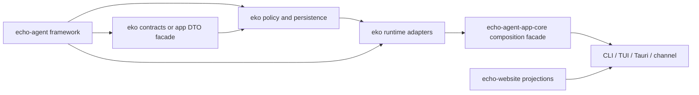

## Context

当前 `echo-agent-app-core` 有 144 个 Rust 文件、约 172,000 行代码。生产代码、测试、EKO 产品策略、持久化投影、surface adapter 和 framework 调用边界集中在同一个 package；`state.rs`、`tasks/task_runtime/store.rs`、`tasks/task_runtime/executor.rs` 等文件已经达到数千到一万多行。

本计划不是把 app-core 整体搬入 `echo-agent`，而是先定义全局最终结构，再在不改变行为的前提下完成应用内模块化，并只在确认产品无关且存在真实复用方时下沉 framework。

## Approach

采用 framework-first、facade-first、authority-preserving 的迁移顺序：

1. 冻结 `echo-agent` 与 EKO 的最终职责、依赖 DAG、公共 API、持久化和 wire 合同。
2. 建立 app-core 稳定 facade，阻断 surface 对内部实现模块的扩散依赖。
3. 在同一个 app-core crate 内按 authority 拆分超大模块，保持现有模块路径通过 facade/re-export 可用。
4. 将测试、DTO、产品 projection 与执行内核分离，但不删除仍属于唯一 authority 的测试。
5. 只有模块化完成并有第二个真实 framework 消费者时，才创建新的 framework API 或迁移通用机制。
6. 最后根据编译和依赖证据决定是否拆出 EKO 内部 contracts/domain/runtime crate。

## Global Constraints

- `echo-agent` 不能依赖 `echo-agent-cli` 或 `echo-agent-app-core`。
- framework 已有的 `AgentTurnDriver`、`RuntimeTaskService`、`RuntimeDagController`、`ToolManager`、Tool artifact、Journal、`PreparedPluginSet` 和 `AgentHandle` 是唯一通用 authority；app-core 不得复制其执行、DAG、retry、cancel、terminal 或 journal reducer。
- EKO 的 `AppState`、workspace identity、文件 TaskRuntime、review/worktree、pool/resource policy、direct-user tool visibility、research/analysis/browser 和 UI/TUI/CLI/channel projection 保持应用层所有权。
- TUI、GUI、CLI/JSONL、channel、cron/background 必须功能对等；不得用 feature 或模块拆分隐藏任一模式的能力。
- EKO CLI 不启用 SQLite；framework 的 SQLite API 仍是合理公共能力，不因 EKO 不使用而删除。
- 保持现有 JSON/JSONL 文件名、事件 tag、serde 字段、TS binding 名称、Tauri/CLI/channel wire shape 和 workspace 数据布局。任何变化都必须先有 round-trip、旧数据读取和跨 surface fixture。
- 所有迁移保留一个 Task graph、一个 turn driver、一个 Tool execution authority、一个 receipt lifecycle、一个 Agent router 和一个 Subagent control authority。
- 新增或移动的代码继续遵守 UTF-8 安全、无 `unwrap`/`expect`/panic/unchecked index、无 `worker` 术语和无密钥日志。
- 正式 framework 文档归 `echo-agent/docs`，EKO 文档归 `echo-agent-cli/docs`，跨仓计划与验收证据归顶层 `docs`。
- framework → CLI → website → superproject gitlink 仍是提交顺序；未 push 的 child commit 不写入最终 superproject gitlink。

## Files

- Create: `echo-agent-cli/docs/adr/0025-app-core-global-modularization.md` — 记录最终分层、兼容合同、迁移顺序和删除条件。
- Modify: `echo-agent-cli/docs/architecture.md` — 更新最终 app-core/framework DAG、模块 owner 和 facade 规则。
- Modify: `echo-agent-cli/docs/MASTER-PLAN.md` — 记录 R4 状态、当前 authority 和阶段证据。
- Modify: `docs/MASTER-PLAN.md` — 增加 R4 全局计划和跨仓验证入口。
- Modify: `echo-agent-cli/echo-agent-app-core/Cargo.toml` — 为最终 crate/module 边界准备依赖与 feature 约束。
- Modify: `echo-agent-cli/Cargo.toml` — 同步 workspace 成员、feature 和 facade 依赖。
- Create: `echo-agent-cli/echo-agent-app-core/src/api/mod.rs` — app-core 稳定 facade。
- Modify: `echo-agent-cli/echo-agent-app-core/src/lib.rs` — 收紧模块公开面并保留明确 re-export。
- Modify: `echo-agent-cli/src` — 将 CLI/TUI 调用收敛到 app-core facade。
- Modify: `echo-agent-cli/src-tauri/src` — 将 Tauri 调用收敛到 app-core facade。
- Modify: `echo-agent-cli/echo-agent-app-core/src/state` — 将 state.rs 按 authority 拆分为子模块。
- Modify: `echo-agent-cli/echo-agent-app-core/src/tasks/task_runtime/store` — 拆分 TaskRuntimeStore 的持久化与 projection authority。
- Modify: `echo-agent-cli/echo-agent-app-core/src/tasks/task_runtime/executor` — 拆分 EKO executor adapter。
- Modify: `echo-agent-cli/echo-agent-app-core/src/agent_router` — 拆分 address、inbox、delivery、recovery 和 projection。
- Modify: `echo-agent-cli/echo-agent-app-core/src/chat_event_log` — 拆分 event、journal、retention、projection 和 recovery。
- Modify: `echo-agent-cli/echo-agent-app-core/src/extension_control` — 拆分 Skill、Plugin、MCP/Hook 和 receipt policy。
- Modify: `echo-agent-cli/echo-agent-app-core/src/plugin_runtime` — 拆分 preparation、publication 和 EKO components。
- Modify: `echo-agent-cli/echo-agent-app-core/src/agent_pool` — 拆分 admission、generation 和 leases。
- Modify: `echo-agent-cli/echo-agent-app-core/src/infra` — 拆分 factory、stores、logging、diagnostics 和 background owners。
- Modify: `echo-agent-cli/echo-agent-app-core/tests` — 迁移 behavior-level contracts。
- Modify: `echo-agent-cli/Cargo.lock` — 同步 workspace dependency graph。
- Modify: `echo-website/docs-sync-manifest.json` — 更新 reviewed child revisions。
- Modify: `echo-website/src/docs/content/eko/en` — 仅在审阅后的产品事实变化时更新。
- Modify: `echo-website/src/docs/content/eko/zh` — 仅在审阅后的产品事实变化时更新。
- Modify: `echo-website/src/docs/links.ts` — 保持源码链接和 facade 路径。
- Modify: `echo-website/public` — 重新生成 discovery/static artifacts。

## Reuse

- `echo-agent/echo-orchestration/src/tasks/runtime_service.rs:120` — `RuntimeTaskService` — 保持 framework DAG execution 和 claim settlement 为唯一通用 task authority。
- `echo-agent/echo-orchestration/src/tasks/runtime_executor.rs:134` — `RuntimeDagController` — 适配 EKO persistence、dispatch、review，不重写 traversal。
- `echo-agent/src/runtime.rs:1` — framework runtime facade — 复用现有 turn driver 和 typed outcome。
- `echo-agent/src/tools/mod.rs:163` — framework Tool facade — 保持 ToolManager、registration、artifact 和 permission primitives 在 framework。
- `echo-agent/src/plugin.rs:1` — `PreparedPluginSet` — framework 负责 immutable preparation，app 负责 target publication。
- `echo-agent-cli/echo-agent-app-core/src/tasks/task_runtime/mod.rs:1` — 当前 EKO TaskRuntime adapter — 保持 public contracts 后拆实现。
- `docs/2026-08-29-tools-app-core-boundary-assessment.md:7` — 当前 ownership decision — 作为迁移边界，不创建第二 authority。

## Todos

### freeze-global-contracts

requirements:
- 用户要求 app-core 重构必须结合 `echo-agent` 全局设计，不能先局部拆分再补兼容。
- framework/app authority、TUI/GUI/CLI/channel 对等和无 SQLite 产品约束必须保持。

interfaces:
- consumes: 当前 framework public facade、app-core `lib.rs`、Cargo manifests、wire fixtures、R1 boundary ledger
- produces: ADR 0025、最终 dependency DAG、public API/serialization/删除清单和后续 todo 不变量

steps:

1. 建立 app-core public symbol、surface 调用、serde/TS binding、持久化文件和 framework authority 的基线清单，并在 ADR 0025 中记录最终 owner、不可变合同和明确不迁移类型。
   verify: ADR 0025 覆盖 framework/app DAG、所有主要大模块 owner、兼容规则和删除条件。
   expected: 每个计划迁移符号都有唯一 owner，没有待确认的跨层取舍。

2. 对照 framework 的 RuntimeTaskService、RuntimeDagController、AgentTurnDriver、ToolManager、PreparedPluginSet 和 Journal API，给每个 app-core 生产路径标注复用、adapter 或 EKO policy。
   verify: architecture docs and ADR contain a symbol-level mapping.
   expected: app-core 不再有需要复制 framework kernel 的待办。

3. 固定模块路径/re-export、JSON/JSONL 字段、事件 tag、TS bindings、文件名、workspace layout、错误 code 和五 surface 行为兼容矩阵。
   verify: baseline fixtures and public API inventory are recorded in the plan evidence.
   expected: 后续拆分只能改变物理路径，不能静默改变外部合同。

### establish-app-facade

requirements:
- app-core 必须从所有模块 public 收敛为稳定 facade，同时保持 CLI、TUI、Tauri 和 channel 调用可迁移。
- facade 不能拥有第二套 runtime、store、DAG 或 status authority。

interfaces:
- consumes: app-core `lib.rs`、所有 surface direct imports、freeze-global-contracts mapping
- produces: `api` facade、兼容 re-exports、visibility map、surface import migration

steps:

1. 创建按 configuration、workspace、chat、task、agent-control、tool-control、extension、research、analysis 和 wire DTO 分组的 `api` facade。
   verify: facade exports compile against current callers without implementation moves.
   expected: 所有 surface 都有明确 facade import path。

2. 将 CLI/TUI/Tauri/channel direct app-core imports 迁移到 facade，并删除只为绕过 facade 而存在的重复 re-export。
   verify: workspace compile and public import contract pass.
   expected: surface 不再依赖 state/store/executor 私有实现文件。

3. 将未被 facade 公开的实现模块收紧为 `pub(crate)` 或 private，并保留 compile-fail contract 防止绕过 facade。
   verify: forbidden internal imports fail and supported imports compile.
   expected: 新模块不会自动成为跨 crate 公共 API。

### split-state-authority

requirements:
- `state.rs` 中的 config、connection、storage、workspace、delivery 和 AppState aggregate 必须物理分离。
- AppState 字段、锁顺序、generation/lease 语义和 settlement 行为必须保持不变。

interfaces:
- consumes: freeze-global-contracts compatibility matrix、establish-app-facade exports、当前 state consumers
- produces: state 子模块、等价 AppState facade、state tests

steps:

1. 将 DTO/config/model mutation、connection/pool、storage、workspace lease、delivery 和 AppState 聚合按 authority 分配到 state 子模块，保持类型名与字段布局。
   verify: state tests and serialization fixtures pass.
   expected: 每个子模块只拥有一个 state domain，AppState 只负责组合和委托。

2. 将 state 内嵌测试按对应 authority 移入 state tests 或 integration tests，保留访问私有字段所需的最小 `pub(crate)` seam。
   verify: state unit and integration test coverage does not regress.
   expected: production module 不再包含跨领域测试大段代码。

3. 更新 facade、re-export 和 surface imports，删除旧 state.rs。
   verify: old state file absent, supported imports resolve, no duplicate AppState exists.
   expected: JSON/TS 类型和五 surface 行为不变。

### split-task-store

requirements:
- TaskRuntimeStore 继续是 EKO 文件事实与 projection authority，framework RuntimeTaskService 继续拥有通用 DAG/claim/cancel/retry。
- store 拆分不得改变事件顺序、CAS、attempt identity、resume、recovery debt 或文件布局。

interfaces:
- consumes: split-state-authority AppState bindings、framework RuntimeTaskService/Controller、current store tests and fixtures
- produces: store facade plus journal/plan/run/projection/recovery/workspace modules

steps:

1. 以 TaskRuntimeStore facade 为中心分离 event/journal、plan/goal、run/claim/turn、projection、recovery 和 workspace supervisor。
   verify: TaskRuntime event and projection fixtures round-trip.
   expected: 每个 store 子模块只有明确事件或 projection 责任，不出现第二写入路径。

2. 按 journal、plan/run、projection、recovery 分组 store tests，覆盖 stale revision、claim ABA、resume、degraded settlement、workspace transition 和 bounded query。
   verify: focused store tests cover every moved authority.
   expected: store 失败可以定位到一个 authority。

3. 保持 `tasks::task_runtime::store::*` facade/re-export，删除旧 store.rs。
   verify: import contract、compile-fail bypass contract 和 app-core tests pass.
   expected: 物理拆分完成但 framework/app 数据边界不变。

### split-task-executor

requirements:
- executor 只能适配 framework DAG，并承载 EKO resource/review/worktree/unattended policy。
- 不得在 adapter 中重写 DAG traversal、retry、cancel 或 terminal reducer。

interfaces:
- consumes: split-task-store facade、framework RuntimeDagController、executor event/review contracts
- produces: executor facade plus limits/dispatch/run/review/unattended/events modules

steps:

1. 分离 EKO resource ceilings、ExecEvent、controller dispatch、run orchestration、review gate、unattended preflight。
   verify: attended、unattended、review、cancel 和 worktree behavior fixtures pass.
   expected: framework controller remains the only generic scheduler.

2. 为各 adapter 子模块补充边界测试，验证 permits、review outcomes、worktree ownership 和 framework resolution round-trip。
   verify: no duplicate transition helper exists and every public adapter outcome is covered.
   expected: 资源、review、执行和事件映射可独立审查。

3. 保持 executor facade/re-export，删除旧 executor.rs 并检查 task tools、Tauri commands 和 background launch。
   verify: app-core workspace tests and import contract pass.
   expected: 所有调用方继续使用同一 executor authority。

### split-routing-and-extensions

requirements:
- AgentRouter、AgentPool、ChatEventLog、ExtensionControl、PluginRuntime 和 Infra 必须按协调、持久化、publication、生命周期和 projection 分离。
- 这些模块继续复用 framework AgentHandle、TurnDriver、Journal、PreparedPluginSet、ToolManager 和 scheduler。

interfaces:
- consumes: app facade、scoped receipts、framework runtime/plugin/tool APIs
- produces: router、chat log、pool、extension、plugin 和 infra 子module facades

steps:

1. 拆 AgentRouter 的 address/groups/inbox/delivery/recovery/projection，保持一个 durable inbox authority 和一个 delivery supervisor。
   verify: agent control、restart、retirement、cross-workspace 和 cursor fixtures pass.
   expected: router 不承担 Task DAG 或 surface-local terminal inference。

2. 拆 ChatEventLog 的 event/journal、retention、projection、recovery；拆 AgentPool 的 admission/generation/leases，保持 workspace generation 和 lock order。
   verify: chat replay、pool lifecycle、deletion 和 generation ABA fixtures pass.
   expected: chat journal、pool admission 和 workspace lifecycle 不再混在同一文件。

3. 拆 ExtensionControl、PluginRuntime、Infra 的 policy、framework preparation、publication、component wiring、stores、logging、diagnostics 和 background owners。
   verify: skill/plugin/MCP/LSP/browser/bootstrap contracts pass without second publication or reload path.
   expected: framework prepared generation 只解析一次，EKO 只负责 target policy 和 receipt。

### migrate-tests-docs-and-crates

requirements:
- 重构必须同步测试、docs、TS bindings、website 和 Cargo workspace，不得留下旧路径或未声明公共入口。
- 只有真实 framework-neutral、多消费者复用的机制才可进入 `echo-agent`。

interfaces:
- consumes: all previous module facades and compatibility matrix
- produces: moved integration contracts、updated docs/website、final crate-extraction decision

steps:

1. 将跨模块 behavior contracts 移到 app-core integration tests，保留私有状态机单元测试，更新 fixture、TS binding export 和 source links。
   verify: test discovery、generated bindings、JSON/JSONL fixtures 和 five-surface contracts pass.
   expected: 测试归属与代码 owner 一致，没有第二套 contract source。

2. 根据编译 timing、依赖 graph 和 public API inventory 判断是否创建 EKO contracts/domain/runtime crate；若不满足多消费者和依赖隔离条件，则保留单一 app-core package 并记录理由。
   verify: decision record contains measured dependency/compile evidence and no unresolved cycle.
   expected: crate 拆分是证据驱动的结果，不是为文件数量服务。

3. 更新 echo-agent-cli docs、顶层 R4 evidence 和 website source/manifest；只在产品事实变化时修改 EKO projection。
   verify: docs source sync、website discovery、site check、build 和 link tests pass.
   expected: framework docs、EKO docs 和 website 各自只有一个事实源。

### final-authority-and-release-gate

requirements:
- 完成后必须删除被替代旧物理实现和重复 facade，保留唯一 authority、可追溯提交和完整验证证据。
- Final Integration/Release 仍是独立阶段，不能被模块化测试冒充完成。

interfaces:
- consumes: all modularized facades, tests, docs and migration decision
- produces: final deletion list, R4 status evidence, child commits and clean handoff

steps:

1. 全仓搜索确认旧 state/store/executor/router/extensions/infra 单文件实现、绕过 facade imports 和重复 authority 已删除。
   verify: symbol/path scan returns only approved facade and one owner per authority.
   expected: 没有旧路径、wrapper 副本或长期双实现。

2. 在 framework、CLI 和 website 执行仓库规定的 fmt、Clippy、workspace tests、no-default、frontend/build、docs sync 和 site checks。
   verify: every applicable command exits 0; unavailable long/GUI/remote gates retain explicit status.
   expected: R4 有可复现 green evidence，不宣称 release readiness。

3. 更新 child MASTER-PLAN、顶层 MASTER-PLAN、R4 ADR 和 superproject handoff，记录 child SHA、剩余 Final Integration/Release gates 和未 push 状态。
   verify: all status tables agree on current SHA、authority 和 remaining gates.
   expected: 后续执行从单一入口恢复，不需要重新推导边界。

## Diagram

## Decisions

- 采用全局设计、分阶段实现；任何单个文件拆分都必须服从最终 authority 和 dependency DAG。
- 首阶段不把 app-core 整体搬到 `echo-agent`，也不把 EKO AppState、workspace、文件 TaskRuntime、review/worktree、research、analysis、browser 或 UI projection 变成 framework API。
- 先在同一 app-core package 内拆模块，再根据编译和依赖证据决定是否拆 EKO 内部 crate。
- AgentRouter、AgentPool 和 ChatEventLog 只有在第二个真实 framework 消费者出现后才进入 framework 迁移评估。
- 兼容目标是当前 workspace 调用方、wire fixtures、持久化文件和五个 surface 行为兼容，不额外保留无调用旧实现。
- 每个阶段完成后必须能独立停止并保持一个真实 authority，不能用先新增以后删除长期保留双实现。
