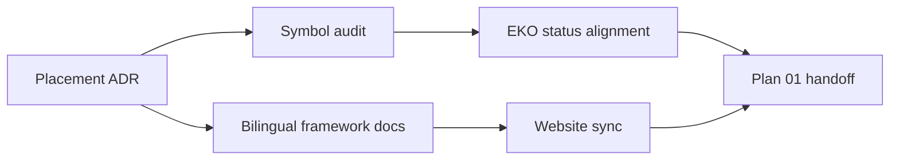

## Approach

- 先冻结通用能力准入合同，再用现有 framework 原语和 app-core 真实依赖完成逐符号 disposition；本计划不创建 pool、router 或其它 kernel API。
- Framework ADR 是准入理由的长期事实源，双语页面说明公共边界，顶层 audit 保存跨仓证据和后续迁移候选。
- EKO 的两个消费者证据只决定是否拆 EKO internal crate，不约束产品无关 primitive 进入 framework。
- Framework 文档先形成 clean child commit，website 再从该 revision 同步，最后更新跨仓状态。

## Global Constraints

- echo-agent 是独立通用框架，现有外部采用量不是 product-neutral API 的资格门槛。
- 每个候选必须分别记录通用机制、EKO 产品策略和适配边界，不得按模块名整体迁移。
- Framework 不依赖 echo-agent-cli、app-core、EKO workspace、Tauri DTO 或产品文件布局。
- 必须复用现有 tracked steer、Subagent control、Task runtime、Journal、PreparedPluginSet 和 ToolManager authority。
- 本计划只审计 AgentPool、AgentRouter、ChatEventLog、PluginRuntimeService 和 ExtensionControlService，不修改 Rust、Cargo、wire、serde 或 TS binding。
- 产品内部执行角色只使用 Subagent 术语。
- EKO internal crate 仍由依赖隔离、编译收益和多消费者证据决定。
- Framework 文档归 echo-agent，EKO 产品文档归 echo-agent-cli，跨仓审计和阶段状态归 superproject。
- Website 只能从 clean、已提交的 framework revision 生成 manifest 和内容。
- 本计划不删除 txt、EKO runtime/soak、空目录或缓存，也不执行 push、release 或远端操作。

## Files

- Modify: `AGENTS.md` — 明确采用量不是 framework 准入硬门槛。
- Create: `echo-agent/docs/adr/0014-framework-capability-placement.md` — 记录准入决策和影响。
- Create: `echo-agent/docs/en/39-framework-application-boundary.md` — 英文公共边界说明。
- Create: `echo-agent/docs/zh/39-framework-application-boundary.md` — 中文公共边界说明。
- Modify: `echo-agent/docs/en/README.md` — 注册英文页面。
- Modify: `echo-agent/docs/zh/README.md` — 注册中文页面。
- Create: `docs/2026-08-30-framework-capability-placement-audit.md` — 保存候选逐符号证据和 disposition。
- Modify: `docs/2026-08-29-tools-app-core-boundary-assessment.md` — 修正准入措辞并链接新审计。
- Modify: `echo-agent-cli/docs/architecture.md` — 区分 framework 与 EKO crate extraction。
- Modify: `echo-agent-cli/docs/adr/0025-app-core-global-modularization.md` — 限定 R4 双消费者条件。
- Modify: `echo-agent-cli/docs/MASTER-PLAN.md` — 记录新合同和后续入口。
- Modify: `docs/MASTER-PLAN.md` — 记录跨仓当前状态和剩余结果。
- Modify: `echo-website/docs-sync-manifest.json` — 绑定 framework revision 和 hashes。
- Create: `echo-website/src/docs/content/echo-agent/en/39-framework-application-boundary.md` — website 英文页面。
- Create: `echo-website/src/docs/content/echo-agent/zh/39-framework-application-boundary.md` — website 中文页面。
- Create: `echo-website/src/docs/content/echo-agent/en/adr/0014-framework-capability-placement.md` — website 英文 ADR。
- Create: `echo-website/src/docs/content/echo-agent/zh/adr/0014-framework-capability-placement.md` — website 中文 ADR。
- Modify: `echo-website/src/docs/framework-adrs.generated.ts` — 注册 framework ADR。
- Modify: `echo-website/src/docs/registry.ts` — 注册 boundary 路由。
- Modify: `echo-website/public` — 生成 sitemap 和 LLM discovery 资产。

## Reuse

- `AGENTS.md:125` — 三分法分层规则 — 扩展现有术语。
- `echo-agent/src/agent/steer.rs:80` — `TurnSteerMailbox` — router 候选复用 tracked input lifecycle。
- `echo-agent/src/agent/subagent/control.rs:300` — `SubagentControlRegistry` — 复用 attempt-scoped control。
- `echo-agent/echo-state/src/journal/segmented.rs:715` — `SegmentedFileEventJournal` — chat 候选复用 journal/replay。
- `echo-agent/src/plugin/prepared.rs:155` — `PreparedPluginSet` — plugin preparation 保持单一 authority。
- `echo-agent/echo-execution/src/tools.rs:829` — shared `ToolManager` — pool 候选不复制工具 authority。
- `echo-agent-cli/docs/adr/0025-app-core-global-modularization.md:65` — EKO crate extraction decision — 保留其适用范围。
- `docs/2026-08-29-tools-app-core-boundary-assessment.md:13` — 旧边界清单 — 修订并链接新 audit。
- `echo-website/scripts/sync-docs.mjs:136` — `verifyFrameworkAdrIndex` — 同步 ADR 双语投影。
- `echo-website/package.json:27` — 现有 docs sync 和 verify scripts — 复用发布门禁。

## Todos

### freeze-framework-admission-contract

requirements:
- § Framework 能力归属
- § Framework 迁移数据流
- § Framework 归属修订
- § 复用与实现约束

interfaces:
- consumes: 当前 AGENTS 分层规则、framework ADR 0001-0013、双语文档索引和 design 准入条件
- produces: capability placement ADR、双语 public boundary 页面和稳定准入术语

steps:

1. 在 ADR 中记录背景、候选规则、准入条件、EKO crate 例外、单一 authority 迁移合同和公共 API 影响。
   verify: ADR 可独立回答能力何时进入 framework、何时保留 EKO、消费者数量是否相关。
   expected: ADR 拒绝采用量硬门槛和模块整体搬迁，同时保留产品策略边界。
2. 将同一规则写入 AGENTS，并与先查重复、框架公共 API 保留规则对齐。
   verify: AGENTS 不要求先有第二消费者才允许通用能力下沉。
   expected: 后续实现必须先做产品无关性、依赖方向和重复 authority 审计。
3. 创建中英文 boundary 页面并更新两个索引。
   verify: 页面路径配对、语义一致且索引链接可解析。
   expected: 外部开发者无需阅读 EKO 计划即可理解 framework 与应用边界。

### audit-candidate-symbols

requirements:
- § 当前候选边界
- § Framework 能力归属
- § Framework 迁移数据流
- § Framework 边界

interfaces:
- consumes: 上一 todo 的准入术语，以及候选区域的定义、注册、构造和生产调用路径
- produces: 每个 scoped symbol 的 existing-framework、extract-kernel、keep-EKO 或 thin-adapter disposition

steps:

1. 全仓搜索候选定义、注册、构造和生产调用，区分已有 authority、EKO policy 与测试或历史路径。
   verify: audit 列出定义路径、framework 原语、EKO 依赖和生产可达证据。
   expected: 不因名称相似推断重复，也不把不可达代码当产品 authority。
2. 为候选赋予唯一 disposition；对 extract-kernel 写明最小语义、EKO wrapper、切换路径和删除目标。
   verify: 五个候选区域均有一个当前 owner 结论。
   expected: 后续 kernel plan 可从明确 symbol 边界启动。
3. 修订旧 boundary assessment，保留仍正确的 tools、TaskRuntime、workspace 和 projection owner。
   verify: 旧评估链接新 audit，且不再把当前已有多个消费者写成资格条件。
   expected: R4 证据可追溯，新规则成为当前入口。

### align-eko-boundary-docs

requirements:
- § 已确认决策
- § 合并与迁移规则
- § Framework 归属修订
- § Framework 边界

interfaces:
- consumes: framework ADR 和 candidate disposition ledger
- produces: 限定清楚的 EKO crate extraction 条件，以及 CLI/top 状态入口

steps:

1. 在 EKO architecture 和 ADR 0025 中明确双消费者证据只决定 EKO internal crate。
   verify: 两份文档同时保留 R4 app-core 决策和新 framework 规则。
   expected: 不再把 packaging 证据误用为 framework API 门槛。
2. 更新 CLI 与顶层 MASTER-PLAN，只记录已完成合同和待授权 kernel/docs/cleanup results。
   verify: 两份状态表的 child SHA、完成度和 residual 一致。
   expected: 未实施工作不被写成完成。
3. 保留历史 R4 plan，但让当前文档明确指向新 ADR 和 audit。
   verify: 当前入口不再把历史第二消费者语句当有效长期约束。
   expected: 历史可追溯且不会覆盖当前规则。

### publish-framework-boundary

requirements:
- § 双语镜像而不是一个混合目录
- § Parity 与 website 发布门禁
- § Framework 归属修订
- § Framework 边界

interfaces:
- consumes: 已提交且 clean 的 framework ADR、双语页面和文档索引
- produces: revision/hash manifest、vendored 页面与 ADR、registry、ADR index 和 discovery assets

steps:

1. 使用现有 docs sync 从精确 framework revision 同步页面和 ADR。
   verify: manifest paths、destinations、sha256 和 revision 与 clean source 一致。
   expected: 新页面与 ADR 在中英文路由可发现。
2. 生成 sitemap、LLM discovery 和静态资产。
   verify: discovery check 和 site check 无缺失路由、未注册文档或 stale assets。
   expected: 导航和发布资产包含新 boundary 内容。
3. 执行 source-aware docs check 和 website 完整门禁。
   verify: `npm run docs:check:source` 与 `npm run verify` 均退出 0。
   expected: clean checkout 可复现文档投影；证据不冒充 Rust release validation。

## Diagram

## Decisions

- Plan 01 只冻结归属合同和 disposition，不实施 kernel。
- EKO internal crate 的多消费者条件继续有效，但不约束 framework primitive。
- 历史 R4 plan 不重写；当前 ADR、architecture、audit 和 MASTER-PLAN 提供 superseding guidance。
- Website 同步是同一正式文档交付的发布层，不提升为独立 Plan。
- Runtime txt、soak、空目录和 cache ignore 属于后续 hygiene Plan。
- CLI 双语目录、strict parity gate 和 EKO website source/hash projection 属于后续独立 Plans。
