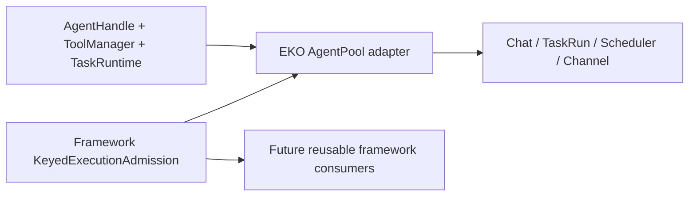

## Approach

- 只抽取 AgentPool admission 的产品无关生命周期：keyed active count、per-key process permit、retirement fence、close、wait 和 drop settlement。
- AgentHandle 创建、key 分类、workspace generation、EkoConfig、ToolControl、Plugin/MCP/model publication、TaskRuntime release adapter 和 surface policy 继续归 EKO。
- framework 提供唯一 keyed admission authority；EKO AgentPoolAdmission 只能是薄转换 wrapper，不保留第二套 active/by-key/retiring reducer。
- framework child 先实现并提交，CLI 再切换真实 AgentPool 主路径，website 最后同步 framework 文档；不 push、不清理 runtime 数据、不执行 docs 全量重组。

## Global Constraints

- framework API 脱离 EKO AppState、workspace、Tauri、EkoConfig、UI DTO 和产品文件布局独立成立。
- 不以第二消费者作为 framework API 准入条件；独立测试、示例、rustdoc 和依赖方向是准入条件。
- 保留一个 AgentPool execution admission、一个 lease lifecycle、一个 retirement/close authority；不得并存旧 reducer 和新 reducer。
- 复用现有 AgentHandle、TurnSteerMailbox、Subagent control、ToolManager、TaskRuntime 和 plugin generation。
- EKO capacity classes 是应用 policy；framework 只处理 opaque key 和通用 keyed admission。
- 不改变 EKO AgentPool、TaskRuntime、TUI/GUI/CLI/channel 的 wire、持久化、workspace layout 或 surface parity。
- 新 framework public API 具备 rustdoc、独立单元测试和 runnable example 或 doctest；遵守无 panic、无 unchecked index、UTF-8 和无 worker 术语规则。
- framework → CLI → website → superproject 按 child commit 顺序交付；不 push。
- 本计划不移动 CLI docs 到 zh/en、不实现 strict docs parity gate、不删除 txt/.eko/空目录或缓存。

## Files

- Create: `echo-agent/src/agent/admission.rs` — generic keyed execution admission、lease 和 retirement primitives。
- Modify: `echo-agent/src/agent/mod.rs` — expose framework admission module。
- Modify: `echo-agent/src/lib.rs` — retain framework public facade exports。
- Create: `echo-agent/docs/adr/0015-keyed-execution-admission.md` — framework boundary ADR。
- Modify: `echo-agent/docs/en/39-framework-application-boundary.md` — English pool kernel boundary。
- Modify: `echo-agent/docs/zh/39-framework-application-boundary.md` — Chinese pool kernel boundary。
- Modify: `echo-agent/docs/en/README.md` — English index entry。
- Modify: `echo-agent/docs/zh/README.md` — Chinese index entry。
- Modify: `echo-agent-cli/echo-agent-app-core/src/agent_pool/admission.rs` — thin EKO adapter。
- Modify: `echo-agent-cli/echo-agent-app-core/src/agent_pool/pool.rs` — use framework admission from AgentPool。
- Modify: `echo-agent-cli/echo-agent-app-core/src/agent_pool/tests.rs` — migrate pool behavior contracts。
- Modify: `echo-agent-cli/echo-agent-app-core/src/runtime.rs` — preserve pool bootstrap boundary。
- Modify: `echo-agent-cli/echo-agent-app-core/src/state/workspace.rs` — preserve workspace pool lease boundary。
- Modify: `echo-agent-cli/echo-agent-app-core/src/tasks/task_runtime/task_execute_tool.rs` — preserve TaskRun pool execution target。
- Modify: `echo-agent-cli/echo-agent-app-core/src/tasks/task_runtime/execution_target.rs` — preserve EKO execution lease contract。
- Modify: `docs/2026-08-30-framework-capability-placement-audit.md` — update AgentPool disposition。
- Modify: `echo-agent-cli/docs/architecture.md` — document framework keyed admission and EKO policy wrapper。
- Modify: `echo-agent-cli/docs/MASTER-PLAN.md` — record AgentPool kernel status。
- Modify: `docs/MASTER-PLAN.md` — update cross-repository status and child revisions。
- Modify: `echo-website/docs-sync-manifest.json` — bind framework/application revision and hashes。
- Modify: `echo-website/src/docs/content/echo-agent/en/39-framework-application-boundary.md` — vendored English page。
- Modify: `echo-website/src/docs/content/echo-agent/zh/39-framework-application-boundary.md` — vendored Chinese page。
- Create: `echo-website/src/docs/content/echo-agent/en/adr/0015-keyed-execution-admission.md` — vendored English ADR。
- Create: `echo-website/src/docs/content/echo-agent/zh/adr/0015-keyed-execution-admission.md` — vendored Chinese ADR。
- Modify: `echo-website/src/docs/framework-adrs.generated.ts` — generated ADR index。
- Modify: `echo-website/src/docs/registry.ts` — boundary route registration。
- Modify: `echo-website/public` — generated discovery/static assets。

## Reuse

- `echo-agent/src/agent/handle.rs:346` — `AgentHandle` — opaque framework handle。
- `echo-agent/src/agent/steer.rs:80` — `TurnSteerMailbox` — existing tracked input lifecycle。
- `echo-agent/echo-execution/src/tools.rs:174` — `ToolManager` — shared tool authority。
- `echo-agent-cli/echo-agent-app-core/src/agent_pool/admission.rs:329` — current admission state to replace。
- `echo-agent-cli/echo-agent-app-core/src/agent_pool/pool.rs:748` — `AgentPool::acquire` production boundary。
- `echo-agent-cli/echo-agent-app-core/src/agent_pool/pool.rs:925` — conversation retirement boundary。
- `echo-agent/echo-orchestration/src/tasks/runtime_service.rs:129` — `RuntimeTaskService` TaskRun authority。
- `docs/2026-08-30-framework-capability-placement-audit.md:35` — AgentPool disposition。
- `echo-website/scripts/sync-docs.mjs:136` — framework ADR sync and hash manifest。

## Todos

### implement-framework-keyed-admission

requirements:
- § Framework 能力归属
- § 当前候选边界
- § Framework 迁移数据流
- § 关键取舍
- § 复用与实现约束

interfaces:
- consumes: 现有 AgentPoolAdmission active/by-key/retiring 语义、framework AgentHandle 和当前 pool contracts
- produces: echo_agent::agent::admission::KeyedExecutionAdmission、lease/retirement/close/wait API、rustdoc、ADR 和双语 boundary 文档

steps:

1. 实现 framework KeyedExecutionAdmission，以 opaque key 管理 accepting、active total/by-key、per-key process permits、retirement fence、close 和 wait；lease drop 线性化计数与 permit release。
   verify: framework 原语不引用 EKO 类型，重复 retirement/close、未知 key、permit capacity 和 drop-after-close 都返回 typed Result 或稳定终态。
   expected: framework admission 是唯一 active/by-key/retiring authority，API 可被任意 Agent 产品复用。
2. 在 framework agent facade 和 crate 文档中公开 API，补充 rustdoc、独立测试和 runnable example/doctest，记录 0015 ADR。
   verify: framework exports、example 和 ADR 链接可解析，名称只使用 Agent/Subagent。
   expected: 外部开发者可在不引入 EKO 的情况下使用 keyed admission。

### migrate-eko-agent-pool-adapter

requirements:
- § 适配器规则
- § 当前候选边界
- § Framework 迁移数据流
- § Framework 已有相同能力
- § 异常与边界场景

interfaces:
- consumes: KeyedExecutionAdmission framework API、EKO AgentPoolAdmission wrapper 和现有 AgentPool callers
- produces: EKO AgentPoolExecutionLease/retirement API backed by framework admission，以及唯一 production path

steps:

1. 将 EKO AgentPoolAdmission 的 active/by-key/retiring/permit 状态替换为 framework admission，保留 PoolError、capacity class、workspace transition 和 EKO receipt 转换。
   verify: wrapper 不再拥有第二 reducer，acquisition/retirement/shutdown 分支都转换 framework typed outcomes。
   expected: AgentPool::acquire、conversation retirement 和 close/wait 保持既有行为。
2. 更新 pool、runtime、workspace、TaskRun execution target 和相关 contracts，使聊天、TaskRun、scheduler、channel 和 workspace 路径都经过同一 wrapper。
   verify: 静态调用路径只存在一个 pool admission owner，旧私有状态字段/重复 permit map 已删除。
   expected: 五 surface 和后台路径继续获得同一 lease 语义。
3. 迁移 stale lease、same-key reuse、retirement ABA、capacity class、workspace transition、shutdown 和 caller drop contracts。
   verify: focused pool contracts 覆盖 framework lease drop 与 EKO receipt settlement，失败返回 typed EKO error。
   expected: 不提前释放 Agent、不重复释放 permit、不吞掉 retirement debt。

### close-pool-boundary-and-publish

requirements:
- § 迁移与 parity gate
- § 范围
- § 异常与边界场景
- § 候选交付结果与依赖
- § 验收标准

interfaces:
- consumes: framework admission commit、EKO adapter commit、现有 docs sync manifest 和 current child status
- produces: updated audit/architecture/status docs、website projection、child gitlinks 和 clean handoff

steps:

1. 更新 audit、EKO architecture/MASTER-PLAN 和顶层 MASTER-PLAN，将 AgentPool disposition 改为 framework keyed admission + EKO policy wrapper，并记录旧 reducer 删除边界。
   verify: docs 对当前 owner、AgentRouter 候选和 EKO internal crate 条件无冲突。
   expected: 后续 AgentRouter plan 可复用同一 keyed admission 判断。
2. 从 clean framework/CLI revisions 同步 website boundary/ADR 页面、manifest、registry、ADR index 和 discovery assets。
   verify: source paths、hashes、framework/application revisions 和中英文路由匹配。
   expected: website 反映实际 framework API 和 EKO adapter。
3. 按仓库规则执行适用 fmt、Clippy、workspace tests、no-default/feature checks、Markdown links 和 website docs/source/site gates；只记录真实结果。
   verify: 所有适用命令 exit 0；未执行的长时、人工和远端发布门禁保持明确未完成。
   expected: keyed admission 抽取可复现、可审阅且不改变 EKO wire/持久化合同。

## Diagram

## Decisions

- Plan 02 只抽取 keyed admission kernel，不整体迁移 AgentPool。
- EKO AgentPool 继续拥有 Agent 创建、key classification、workspace/plugin/model/tool policy。
- Framework admission owns active/by-key/retiring/close/wait and per-key process permit lifecycle。
- 第二消费者不再是准入条件；只可作为 API adoption 或 EKO internal crate packaging evidence。
- 旧 EKO admission reducer 在真实主路径切换后删除，不保留长期双实现。
- CLI docs zh/en 重组、strict parity gate、AgentRouter kernel 和 hygiene cleanup 由后续独立计划处理。
