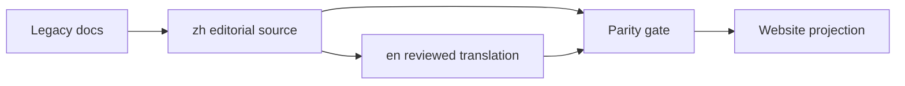

## Context

Plan 03 已建立 35 条 legacy 文档迁移清单和 fail-closed parity foundation。本计划执行真实内容迁移：zh 先完成代码核对，en 逐页翻译并审阅，最后才删除旧根路径并同步 website。

## Approach

- 按 architecture、reference/operations、status/ADR、publish 四批交付；每批完成后可独立停止并通过 gate。
- 保持 Markdown 结构、代码块、命令、路径、协议字段和 ADR identity；合并重复当前事实时保留历史决策在 ADR。
- 英文翻译不得由未翻译混合页面复制产生；manifest 只有在 reviewed 状态后才允许 website 同步。

## Global Constraints

- zh 是编辑主源，en 是审阅翻译；两种语言同等发布。
- 相对路径集合完全一致，ADR 编号/状态/superseded 指向完全一致。
- 不改变 Rust/TypeScript/API/wire/持久化/五个交互 surface。
- 删除只针对已迁移且无引用的 legacy 文档；不删除 .txt、.eko、空目录、缓存或运行证据。
- website 同步只能消费 clean CLI revision，且必须先通过 parity gate。

## Files

- Modify: `echo-agent-cli/docs/README.md`
- Create: `echo-agent-cli/docs/zh/`
- Create: `echo-agent-cli/docs/en/`
- Create: `echo-agent-cli/docs/zh/architecture/`
- Create: `echo-agent-cli/docs/en/architecture/`
- Create: `echo-agent-cli/docs/zh/operations/`
- Create: `echo-agent-cli/docs/en/operations/`
- Create: `echo-agent-cli/docs/zh/adr/`
- Create: `echo-agent-cli/docs/en/adr/`
- Create: `echo-agent-cli/docs/zh/project-status.md`
- Create: `echo-agent-cli/docs/en/project-status.md`
- Delete: `echo-agent-cli/docs/architecture/`
- Delete: `echo-agent-cli/docs/architecture.md`
- Delete: `echo-agent-cli/docs/persistence.md`
- Delete: `echo-agent-cli/docs/architecture/providers.md`
- Delete: `echo-agent-cli/docs/architecture/runtime-task-service.md`
- Delete: `echo-agent-cli/docs/configuration.md`
- Delete: `echo-agent-cli/docs/features.md`
- Delete: `echo-agent-cli/docs/getting-started.md`
- Delete: `echo-agent-cli/docs/skill-sync.md`
- Delete: `echo-agent-cli/docs/MASTER-PLAN.md`
- Delete: `echo-agent-cli/docs/adr/`
- Modify: `echo-agent-cli/README.md`
- Modify: `echo-agent-cli/scripts/check-docs-parity.mjs`
- Modify: `echo-agent-cli/docs/doc-parity-manifest.json`
- Modify: `echo-website/scripts/sync-docs.mjs`
- Modify: `echo-website/docs-sync-manifest.json`

## Reuse

- `echo-agent-cli/scripts/check-docs-parity.mjs` — Plan 03 fail-closed checker。
- `echo-agent-cli/docs/doc-parity-manifest.json` — legacy 到目标路径的唯一清单。
- `echo-agent-cli/skills/translation/SKILL.md` — 技术文档翻译原则和保护格式。
- `echo-website/scripts/sync-docs.mjs:184` — application revision/hash 与 clean-source 检查。

## Todos

### migrate-architecture-docs

requirements:
- § 双语文档信息架构
- § 文档职责
- § 合并与迁移规则
- § 翻译与 parity gate
- § ADR 与当前架构冲突

interfaces:
- consumes: legacy architecture.md、persistence.md、architecture/providers.md、architecture/runtime-task-service.md。
- produces: docs/{zh,en}/architecture/{overview,runtime,persistence,providers}.md。

steps:

1. 从 legacy 文档抽取当前 authority，合并 overview/runtime/persistence 的重复段落并更新相对链接。
   verify: 每项当前架构事实只在一个页面维护，代码路径和 ADR 引用可解析。
   expected: architecture 页面职责清晰且无旧路径引用。
2. 逐页生成并审阅 en 翻译，保留代码/API/命令/路径格式并更新 manifest reviewed 状态。
   verify: zh/en 章节与边界语义等价，英文 prose 无中文混排或未审阅标记。
   expected: 架构批次 parity gate 通过。
3. 删除已迁移的 legacy architecture 文件并更新 README/内部 links。
   verify: 全仓 Markdown link check 不命中旧路径。
   expected: 旧架构根文件不再是事实源。

### migrate-reference-and-operations

requirements:
- § 文档职责
- § 合并与迁移规则
- § 翻译与 parity gate

interfaces:
- consumes: configuration.md、features.md、getting-started.md、skill-sync.md 和 architecture 新路径。
- produces: docs/{zh,en}/{configuration,features,getting-started}.md 与 docs/{zh,en}/operations/skill-sync.md。

steps:

1. 迁移 reference/tutorial/operations 页面并修复到 architecture、ADR、framework 文档的链接。
   verify: 每页有唯一职责，页面内链接只指向新双语树或权威 framework 源。
   expected: reference 和 operations 批次路径对称。
2. 完成 en 翻译和术语校对，检查代码块、命令输出、API 名称和配置字段未被误译。
   verify: parity gate 通过语言和 reviewed 检查，中文主源与英文页面信息完整等价。
   expected: 用户可用任一语言完成入门、配置和 Skill 同步。
3. 删除旧根页面并更新 CLI README。
   verify: legacy paths 无生产/文档引用。
   expected: 根 docs 只保留语言入口。

### migrate-status-and-adrs

requirements:
- § 文档职责
- § 合并与迁移规则
- § 翻译与 parity gate
- § ADR 与当前架构冲突

interfaces:
- consumes: MASTER-PLAN.md 和 25 个 legacy ADR。
- produces: docs/{zh,en}/project-status.md 与 docs/{zh,en}/adr/*.md。

steps:

1. 迁移 project status，保留当前 SHA、阶段状态、residual 和证据入口；删除重复架构叙述。
   verify: status 页面只记录当前状态，历史决策回到 ADR。
   expected: 两个 project-status 页面可独立作为应用事实源。
2. 为 25 个 ADR 生成 zh 主源和 en 审阅翻译，保持编号、状态、候选、决定、影响和 superseded identity。
   verify: ADR identity 逐项一致，英文无 pending/unreviewed 标记，跨 ADR 链接解析。
   expected: 25 对 ADR 全部通过 parity gate。
3. 删除旧 MASTER-PLAN/adr 根路径并更新所有链接。
   verify: 全仓搜索不再命中旧文档路径。
   expected: legacy 文档事实源完全退出。

### publish-bilingual-docs

requirements:
- § 翻译与 parity gate
- § Website 生成资产扩展名为 `.txt`
- § 运行数据保护

interfaces:
- consumes: 通过 parity 的 clean CLI revision 和现有 website sync manifest。
- produces: website 双语 application projection、sourcePath/hash 记录和 discovery assets。

steps:

1. 将 parity checker 接入 website sync 前置检查，并在 manifest 记录 CLI zh/en reviewed revision 和每页 hash。
   verify: dirty、缺配对或未审阅 checkout 无法同步 website。
   expected: 官网只发布 parity 通过的双语文档。
2. 运行现有 Markdown links、website docs/source、discovery、build 和 site gates。
   verify: 所有适用 gates 退出 0，旧路径和单语言投影无残留。
   expected: CLI 与官网双语内容同等发布且 revision 可追溯。

## Diagram

## Decisions

- 内容迁移按四个批次执行，不把 35 个文件一次性移动到未审阅状态。
- ADR 历史保留并双语化，不合并成一个架构大文档。
- .txt、.eko、空目录和缓存另行清理。