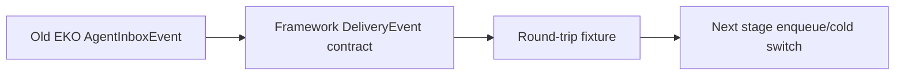

## Historical status

本计划是早期 contract-first 阶段的历史记录，已由 framework ADR 0019 和 EKO ADR 0026
取代。当前实现直接使用 typed `DeliveryLedger<Route, Payload>`、`DeliveryRecord`、`DeliveryClaim`
和 `DeliveryInFlight`；没有把 EKO inbox 生命周期包装成对外适配器，也没有保留本计划所描述的
legacy replay authority。旧的“不切换生产路径”结论只代表当时的阶段门，不是当前状态。

## Context

只读调查确认 AgentRouter 已经组合 framework journal，但 inbox event、projection、FIFO/retention 和 EKO authorship 仍混在应用层。直接替换 schema 会破坏已持久消息，因此第一阶段先在 framework 冻结无产品类型的 ledger contract，并用 EKO fixture 证明无损映射；生产 enqueue/cold authority 切换留在下一阶段。

## Approach

- 在 echo-state 增加可独立使用的 DeliveryEnvelope、DeliveryEvent 和 DeliveryLedgerProjection，复用现有 JournalEvent、EventReducer、CheckpointedReducer、PreparedJournalBatch。
- ledger 只接受 opaque route、stable IDs、JSON payload/metadata 和 typed lifecycle fields；不引用 WorkspaceId、ConversationStore、AgentMessage、groups 或 UI DTO。
- EKO 先通过字段级 fixture 验证转换，不在本阶段写入新 durable schema；旧 AgentInboxEvent 继续是生产 authority，避免旧事件无法回放。

## Global Constraints

- 保留 User/Agent/Reply authorship、stable reply/delivery IDs、correlation/causation、wake policy 和 Conversation/TaskSubagent 分叉。
- EffectStarted 必须携带 actual turn identity；Drained 只能由 framework context insertion 结果驱动；owner-loss 为 OutcomeUnknown 且禁止 replay。
- logical terminal retention 仍由 ledger config 参数化，不能把 journal segment pruning 当作 256/256 KiB 语义替代。
- 不删除或改写 EKO AgentInboxEvent、AgentInboxProjection、AgentDeliverySupervisor、groups、target manifest 或运行数据。
- 不引入 SQLite、第二 mailbox、第二 TaskSubagent control authority 或 worker 术语。

## Files

- Create: `echo-agent/echo-state/src/delivery.rs` — product-neutral delivery contract and reducer。
- Modify: `echo-agent/echo-state/src/lib.rs` — expose delivery module。
- Create: `echo-agent/docs/adr/0016-delivery-ledger-contract.md` — framework boundary ADR。
- Create: `echo-agent/docs/en/41-delivery-ledger.md` — English framework API page。
- Create: `echo-agent/docs/zh/41-delivery-ledger.md` — Chinese framework API page。
- Modify: `echo-agent-cli/echo-agent-app-core/src/agent_router/tests.rs` — EKO field-level round-trip fixture。
- Modify: `echo-agent-cli/docs/zh/architecture/runtime.md` — stage handoff and authority boundary。
- Modify: `echo-agent-cli/docs/en/architecture/runtime.md` — stage handoff and authority boundary。
- Modify: `docs/2026-08-30-framework-capability-placement-audit.md` — current owner/phase ledger。
- Modify: `docs/MASTER-PLAN.md` — phase status and next handoff。

## Reuse

- `echo-agent/echo-state/src/journal/mod.rs:263-275` — generic JournalEvent contract。
- `echo-agent/echo-state/src/journal/mod.rs:344-537` — PreparedJournalBatch and stable identity。
- `echo-agent/echo-state/src/journal/mod.rs:1081-1140` — EventJournal append/lookup/replay。
- `echo-agent/echo-state/src/journal/mod.rs:1301-1680` — EventReducer and CheckpointedReducer。
- `echo-agent-cli/echo-agent-app-core/src/agent_router/address.rs:164-471` — EKO AgentMessage/phase fields for fixture mapping。
- `echo-agent-cli/echo-agent-app-core/src/agent_router/tests.rs:528-675` — existing idempotency/FIFO/stale contracts。

## Todos

### implement-framework-delivery-ledger-contract

requirements:
- § Framework 能力归属
- § 当前候选边界
- § Framework 迁移数据流
- § 异常与边界场景
- § 关键取舍

interfaces:
- consumes: framework journal/checkpoint primitives and EKO AgentInboxEvent lifecycle field inventory。
- produces: `echo_state::delivery::{DeliveryEnvelope,DeliveryEvent,DeliveryLedgerProjection,DeliveryPhase,DeliveryOutcome}`。

steps:

1. 定义 opaque route/envelope、stable lifecycle event、attempt identity、outcome 和 retention config，全部使用 serde-safe product-neutral fields。
   verify: public types 不引用 EKO crate/type，字段可覆盖旧 phase/attempt/turn/correlation 语义。
   expected: framework contract 可独立被任意 Agent 产品使用。
2. 实现 projection reducer、FIFO frontier、in-flight/stale claim 检查和 terminal count/byte bounded retention。
   verify: journal replay、checkpoint recovery、duplicate identity、invalid transition 和 retention bound 有 typed error/稳定 invalid state。
   expected: framework ledger 不需要第二 mailbox 或产品 reducer。
3. 补 framework unit tests、doctest、ADR 和双语 API 文档。
   verify: focused tests 和 rustdoc 证明 FIFO、retry/defer、effect/accepted/drained/settled、owner-loss 和 retention。
   expected: contract 在 framework 内独立可验证。

### add-eko-roundtrip-contract

requirements:
- § 适配器规则
- § Framework 迁移数据流
- § 异常与边界场景

interfaces:
- consumes: EKO AgentMessage/AgentInboxEvent and framework DeliveryEnvelope/Event。
- produces: EKO test-only field-level round-trip fixture。

steps:

1. 在 EKO tests 中建立 AgentMessage ↔ DeliveryEnvelope 结构化转换 fixture，覆盖 User/Agent/Reply、IDs、route、payload、metadata、wake policy 和 TaskSubagent 分叉。
   verify: round-trip 字段级 equality；不改变生产 journal 或 surface path。
   expected: 下一阶段切换有无损转换证据。
2. 更新 runtime 双语文档记录旧 EKO authority 与 framework contract handoff。
   verify: 文档不声称 production path 已切换。
   expected: 迁移状态可审计。

### record-router-phase-handoff

requirements:
- § 当前候选边界
- § 候选交付结果与依赖
- § 验收标准

interfaces:
- consumes: framework contract commit and EKO fixture evidence。
- produces: top-level owner ledger and next-stage handoff。

steps:

1. 更新 audit/MASTER-PLAN，明确第一阶段完成 contract freeze，EKO AgentRouter 生产 authority 未切换。
   verify: current owner、删除目标和下一阶段 enqueue/cold switch 边界一致。
   expected: 不把 contract-only 误报为 migration complete。

## Diagram

## Decisions

- 第一阶段先冻结 contract 和无损 fixture，避免直接改写旧 inbox schema。
- 下一阶段才切换真实 enqueue/cold path，并在新 authority覆盖后删除旧 reducer。
- live supervisor、groups、Workspace/Conversation policy 和 TaskSubagent control 保持 EKO。
