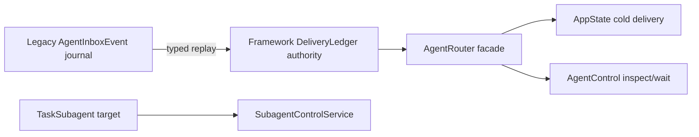

## Historical status

本计划描述的“legacy replay adapter + 保留旧 wire”迁移方案已被开发期的直接 typed
schema 切换取代。当前 AgentRouter 直接实例化 framework `DeliveryLedger`，旧
`AgentInboxEvent`、legacy journal/checkpoint codec 与转换模块均已删除；开发期 schema reset
是有意的取舍。保留本文件仅用于记录曾经评估过的迁移路径，不得把其中的 adapter、兼容 wire
或 Phase 3 deletion target 当作当前待办。

## Context

Phase 1 已在 framework 冻结 product-neutral DeliveryLedger，并在 EKO 完成 AgentMessage 字段级 round-trip fixture；生产 AgentRouter 仍由 AgentInboxEvent projection 和 authority 驱动。本阶段完成 handoff 中约定的 legacy replay adapter 与一条真实 enqueue/cold path 切换，同时保持旧 journal 可恢复。

## Approach

- 复用现有 `EventJournal`、`CheckpointedReducer`、`SegmentedFileEventJournal` 和 `FileCheckpointStore`，不创建第二 mailbox 或 SQLite store。
- framework ledger 增加 prepared batch 的显式应用与只读 lookup/reconciliation，让 EKO adapter 能保留 `NotCommitted`、reopen、`AlreadyCommitted` 和 `Degraded` 的错误边界。
- EKO 为现有 target inbox 建立一个 typed `EventJournal<DeliveryEvent>` adapter，直接映射既有 `AgentInboxEvent` journal；旧文件保持唯一物理 journal，framework `DeliveryLedger` 成为唯一 projection/retry authority，不产生第二 durable mailbox，也不会因旧 segment pruning 丢失 cursor。旧事件只在 adapter 边界转换，未知映射 fail closed。
- `AgentRouter` 对外 facade、groups、Workspace/Conversation retirement、live-vs-cold selection、wake scheduling 和 surface DTO 保持不变；内部 projection 读取从 framework record 映射为原有 `FoldedDelivery`，因此现有 AppState cold path 无需引入第二条 runtime。
- TaskSubagent target 不经过 Conversation delivery ledger，继续由 `SubagentControlService` 负责 exact-attempt receipt/control。

## Global Constraints

- framework 不引用 `WorkspaceId`、`AgentMessage`、ConversationStore、groups、EKO file layout 或 UI DTO。
- 旧 `AgentInboxEvent` journal 必须可读取；迁移失败、未知提交结果或映射缺失时 fail closed，不删除或覆盖旧数据。
- `EffectStarted` 必须先于任何副作用；`MailboxAccepted` 与 `Drained` 只能由实际 framework input receipt 驱动；owner-loss 使用 `OutcomeUnknown` 且禁止 replay。
- 保留 User/Agent/Reply authorship、stable message/reply/delivery IDs、correlation/causation、wake policy、FIFO、attempt 和 256 条/256 KiB logical terminal retention。
- 不删除旧 projection、recovery、groups 或 runtime 数据；删除目标记录在 Phase 3，不能在本阶段保留第二个写入 authority。
- 不引入 SQLite、worker 术语、第二 TaskSubagent control 或新的产品状态机。

## Files

- Modify: `echo-agent/echo-state/src/delivery.rs` — prepared/reconciliation contract。
- Modify: `echo-agent/echo-state/src/journal/mod.rs` — stable prepared-batch and receipt mapping constructors。
- Create: `echo-agent/docs/adr/0017-delivery-ledger-reconciliation.md` — framework API decision。
- Modify: `echo-agent/docs/en/41-delivery-ledger.md` — English API contract update。
- Modify: `echo-agent/docs/zh/41-delivery-ledger.md` — Chinese API contract update。
- Modify: `echo-agent-cli/echo-agent-app-core/src/agent_router/inbox.rs` — framework authority state and lifecycle。
- Modify: `echo-agent-cli/echo-agent-app-core/src/agent_router/address.rs` — journal API imports for the adapter。
- Modify: `echo-agent-cli/echo-agent-app-core/src/agent_router/mod.rs` — include the legacy adapter module。
- Modify: `echo-agent-cli/echo-agent-app-core/src/agent_router/delivery.rs` — framework append/reopen handling。
- Modify: `echo-agent-cli/echo-agent-app-core/src/agent_router/recovery.rs` — migrated target recovery and conversion calls。
- Modify: `echo-agent-cli/echo-agent-app-core/src/agent_router/projection.rs` — framework projection adapter view。
- Modify: `echo-agent-cli/echo-agent-app-core/src/agent_router/router.rs` — cursor/event reads through framework authority。
- Create: `echo-agent-cli/echo-agent-app-core/src/agent_router/legacy.rs` — typed legacy journal adapter and event mapping。
- Modify: `echo-agent-cli/echo-agent-app-core/src/agent_router/tests.rs` — migration, crash/reopen, mapping and production facade evidence。
- Modify: `echo-agent-cli/echo-agent-app-core/src/state/app_state.rs` — existing Agent delivery call path handoff, without new runtime owner。
- Modify: `echo-agent-cli/docs/zh/architecture/runtime.md` — Phase 2 authority handoff。
- Modify: `echo-agent-cli/docs/en/architecture/runtime.md` — Phase 2 authority handoff。
- Modify: `echo-agent-cli/docs/zh/project-status.md` — current phase and residuals。
- Modify: `echo-agent-cli/docs/en/project-status.md` — current phase and residuals。
- Modify: `docs/2026-08-30-framework-capability-placement-audit.md` — owner and deletion ledger。
- Modify: `docs/MASTER-PLAN.md` — phase status and child baselines。

## Reuse

- `echo-agent/echo-state/src/delivery.rs` — Phase 1 envelope, lifecycle and retention projection。
- `echo-agent/echo-state/src/journal/mod.rs` — `PreparedJournalBatch`, `EventJournal`, `CheckpointedReducer`, typed unknown-outcome errors and checkpoint recovery。
- `echo-agent-cli/echo-agent-app-core/src/agent_router/address.rs` — stable EKO message and legacy event schema。
- `echo-agent-cli/echo-agent-app-core/src/agent_router/delivery.rs` — existing append/reopen/durability error handling and retirement locking。
- `echo-agent-cli/echo-agent-app-core/src/state/app_state.rs:1965-3195` — existing enqueue, live/cold delivery, owner-loss and shutdown call paths。

## Todos

### extend-framework-ledger-reconciliation

requirements:
- § Framework 能力归属
- § Framework 迁移数据流
- § 异常与边界场景
- § 关键取舍

interfaces:
- consumes: Phase 1 `DeliveryLedger` and journal primitive APIs。
- produces: public prepared/reconciliation methods for product adapters。

steps:

1. Expose a prepared batch application path and read-only journal reconciliation while preserving projection preflight and retention invariants.
   verify: a caller can retry only `NotCommitted`, while unknown outcomes require reopen/lookup before any retry.
   expected: app adapters do not bypass the framework reducer or invent a second journal authority.
2. Add framework tests and ADR/bilingual docs for retry/reopen/AlreadyCommitted semantics.
   verify: focused framework tests cover exact batch identity, checkpoint fold and degraded durability semantics.
   expected: public contract is independently documented and executable.

### switch-eko-router-authority

requirements:
- § 当前候选边界
- § Framework 迁移数据流
- § 异常与边界场景
- § 关键取舍

interfaces:
- consumes: EKO `AgentInboxEvent`, `AgentInboxProjection`, existing `AgentRouter` facade。
- produces: framework-backed `AgentInboxAuthority` with legacy replay adapter。

steps:

1. Implement total, typed mappings between legacy events and framework events, including EKO envelope metadata and Deferred/TurnSettled semantic normalization.
   verify: every legacy event variant is covered and field-level conversion preserves identity, authorship and wake metadata.
   expected: replay has no stringly-typed or lossy fallback.
2. On authority open, wrap the existing legacy journal with the typed framework adapter, then route all router reads/writes/cursor operations to the framework projection.
   verify: existing target journals recover through their original physical sequence, new target enqueue/cold path writes through framework events mapped to the same journal, and no second mailbox directory is created.
   expected: one framework write authority and one physical journal per target; legacy event encoding is only a wire adapter.
3. Keep retirement and supervisor lifecycle linearization around the new authority; retain the old event shape only as a compatibility wire behind the framework authority.
   verify: target/workspace retirement closes framework handles and cannot race a late enqueue.
   expected: no second mailbox or leaked live handle.

### prove-real-cold-path-handoff

requirements:
- § Framework 迁移数据流
- § 异常与边界场景
- § 验收标准

interfaces:
- consumes: existing `AppState::send_agent_message_owned` and `deliver_agent_message_cold` call paths。
- produces: production call-path evidence and bilingual status handoff。

steps:

1. Route the existing facade-backed cold delivery through the framework authority while preserving runtime wake, input receipt, owner-loss and reply behavior.
   verify: focused app-core delivery tests exercise enqueue -> claim -> effect -> accepted -> drained -> settled through the existing facade.
   expected: no AppState second mailbox or direct framework journal access.
2. Update bilingual runtime/status docs with the exact authority and remaining legacy deletion boundary.
   verify: docs state Phase 2 production cutover and do not claim legacy deletion or full migration.
   expected: code/docs/website source revision remains auditable.

### record-router-phase2-handoff

requirements:
- § 当前候选边界
- § 候选交付结果与依赖
- § 验收标准

interfaces:
- consumes: framework and CLI commits plus focused delivery evidence。
- produces: top-level owner ledger and next-stage deletion targets。

steps:

1. Record the exact framework-backed authority, legacy compatibility scope and Phase 3 deletion targets in the audit and MASTER-PLAN.
   verify: current owner, old journal policy, next deletion symbols and production path are explicit.
   expected: status cannot be misread as contract-only or full cleanup.

## Diagram

## Decisions

- Use a typed framework journal adapter over the existing per-target legacy journal; the old event shape remains a compatibility wire format, not a second active authority.
- Switch the shared AgentRouter facade so the existing AppState cold path is the first observable production consumer.
- Defer deletion of old `AgentInboxProjection`, event conversion code and old event wire definitions until a subsequent plan proves clean-checkout replay and retirement coverage; the physical journal path remains unchanged.
