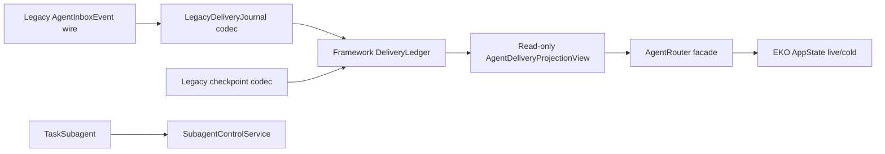

## Historical status

本计划的删除目标已完成，但“保留 legacy wire/checkpoint codec”这一兼容性假设已被开发期
直接 typed schema reset 取代。当前 AgentRouter 没有 `AgentInboxProjection`、`FoldedDelivery`、
`LegacyDeliveryJournal` 或 legacy checkpoint codec；framework typed ledger 是唯一 durable
authority。该计划正文保留原始决策和验收背景，当前实现与公开 API 以 framework ADR 0019、
EKO ADR 0026 及其双语文档为准。

## Context

Phase 2 已将 AgentRouter 的所有生产读写切换到 framework `DeliveryLedger`，但 app-core 仍保留旧 `AgentInboxProjection`、`FoldedDelivery` 和对应 EventReducer/retention 测试。它们不再拥有生产 authority，却继续制造重复维护面。旧 `AgentInboxEvent` wire 和已 pruning journal 的 checkpoint 仍需要最小 codec，不能与旧 reducer 一起删除。

## Approach

- 删除 `projection.rs` 中的旧 reducer、frontier fold、terminal retention 和全量校验；`AgentRouter` 读取 framework `DeliveryRecord`，通过只读 `AgentDeliveryProjectionView` 映射既有应用 DTO。
- 将旧 checkpoint JSON 的反序列化缩减为 legacy codec，仅在 framework checkpoint 缺失且旧 journal retained floor 大于 1 时 bootstrap；codec 不实现 `EventReducer`、不写旧 checkpoint、不维护 retry/frontier。
- `LegacyDeliveryJournal` 继续把 framework `DeliveryEvent` 映射到既有 `AgentInboxEvent` wire，保证物理 journal、sequence、lookup/reopen 和 pruning 不变；这不是第二 mailbox。
- 删除直接操纵旧 projection 的性能测试，保留 facade-level lifecycle/recovery/retirement 测试，并让 framework 自有 tests 负责通用 retention/validation。

## Global Constraints

- framework 不引用 EKO 类型；EKO adapter 不复制通用 FIFO、retry、terminal 或 validation 语义。
- 旧 journal wire 可读写，旧 retained-floor checkpoint 可转换；codec 映射失败必须 fail closed，不删除用户数据。
- `EffectStarted`、`MailboxAccepted`、`Drained`、owner-loss、TaskSubagent 分叉和 stable IDs 语义不变。
- 不引入 SQLite、第二 mailbox、第二 reducer、worker 术语或新的产品状态机。
- 不删除物理旧 journal、groups、workspace/retirement policy 或 live/cold runtime；最终 release/clean-checkout 门禁另行记录。

## Files

- Delete: `echo-agent-cli/echo-agent-app-core/src/agent_router/projection.rs` — obsolete app reducer and FoldedDelivery authority。
- Modify: `echo-agent-cli/echo-agent-app-core/src/agent_router/mod.rs` — remove obsolete projection include。
- Modify: `echo-agent-cli/echo-agent-app-core/src/agent_router/legacy.rs` — minimal checkpoint codec and read-only framework view。
- Modify: `echo-agent-cli/echo-agent-app-core/src/agent_router/inbox.rs` — framework-backed authority type wiring。
- Modify: `echo-agent-cli/echo-agent-app-core/src/agent_router/delivery.rs` — framework checkpoint bootstrap without old reducer。
- Modify: `echo-agent-cli/echo-agent-app-core/src/agent_router/recovery.rs` — view-based facade mapping。
- Modify: `echo-agent-cli/echo-agent-app-core/src/agent_router/router.rs` — view/cursor reads through framework authority。
- Modify: `echo-agent-cli/echo-agent-app-core/src/agent_router/tests.rs` — framework-backed regression suite。
- Create: `echo-agent/docs/adr/0018-agent-router-legacy-wire-boundary.md` — final framework/application compatibility boundary。
- Modify: `echo-agent/docs/en/41-delivery-ledger.md` — framework compatibility boundary。
- Modify: `echo-agent/docs/zh/41-delivery-ledger.md` — framework compatibility boundary。
- Modify: `echo-agent-cli/docs/zh/architecture/runtime.md` — Phase 3 authority status。
- Modify: `echo-agent-cli/docs/en/architecture/runtime.md` — Phase 3 authority status。
- Modify: `echo-agent-cli/docs/zh/project-status.md` — Phase 3 authority status。
- Modify: `echo-agent-cli/docs/en/project-status.md` — Phase 3 authority status。
- Modify: `docs/2026-08-30-framework-capability-placement-audit.md` and `docs/MASTER-PLAN.md` — Phase 3 handoff。

## Reuse

- `echo-agent/echo-state/src/delivery.rs` — `DeliveryLedgerProjection`, `DeliveryRecord`, `from_records`, lifecycle and retention authority。
- `echo-agent/echo-state/src/journal/mod.rs` — checkpoint store, prepared identity, journal lookup/reopen and replay。
- `echo-agent-cli/echo-agent-app-core/src/agent_router/legacy.rs` — existing typed event wire adapter。
- `echo-agent-cli/echo-agent-app-core/src/agent_router/router.rs` and `recovery.rs` — shared facade call paths and retirement guards。

## Todos

### remove-eko-projection-authority

requirements:
- § Framework 能力归属
- § Framework 迁移数据流
- § 异常与边界场景
- § 关键取舍

interfaces:
- consumes: framework `DeliveryLedgerProjection` and legacy checkpoint JSON。
- produces: app-owned read-only delivery view and minimal legacy codec。

steps:

1. Replace old projection callback types with a framework-backed view exposing only the fields required by AgentRouter facade adapters.
   verify: recovery/router code compiles without `AgentInboxProjection` or `FoldedDelivery`, and no app reducer owns lifecycle transitions.
   expected: app layer has no duplicate lifecycle state machine.
2. Move retained-floor checkpoint bootstrap to the minimal codec and remove old checkpoint/reducer writes.
   verify: full old journal and already-pruned journal with a valid legacy checkpoint both recover; invalid/missing checkpoint fails closed when required.
   expected: old data remains recoverable without retaining the obsolete reducer.

### migrate-router-regressions

requirements:
- § Framework 迁移数据流
- § 异常与边界场景
- § 验收标准

interfaces:
- consumes: existing AgentRouter facade and framework delivery tests。
- produces: focused app-core regression evidence。

steps:

1. Remove tests whose only authority is the deleted app projection and add facade-level checks for framework records, wire replay, checkpoint, retirement and TaskSubagent isolation.
   verify: no test calls old `apply_checked`, `full_validation_count` or old frontier fields; focused router suite remains green.
   expected: tests protect the actual authority rather than a dead implementation.

### update-phase3-docs

requirements:
- § 当前候选边界
- § Framework 迁移数据流
- § 异常与边界场景

interfaces:
- consumes: final child implementation and Phase 2 handoff。
- produces: bilingual architecture/status pages and framework ADR。

steps:

1. Document the deleted app reducer, retained wire/checkpoint codec, and final framework/EKO ownership.
   verify: zh/en parity and website source-aware sync remain valid.
   expected: no stale claim that legacy projection is an active authority.

### record-phase3-handoff

requirements:
- § 当前候选边界
- § 候选交付结果与依赖
- § 验收标准

interfaces:
- consumes: framework, CLI and website commits。
- produces: top-level phase ledger and release residuals。

steps:

1. Record exact symbols deleted, compatibility codec retained, child SHAs and remaining final integration gates.
   verify: top-level owner ledger is consistent with child docs and website manifest.
   expected: Phase 3 can stop without misreporting release readiness.

## Diagram

## Decisions

- Delete the obsolete app reducer now that framework owns all lifecycle and retention semantics.
- Retain only the minimal legacy wire/checkpoint codec required for persisted EKO data; it cannot mutate lifecycle state.
- Do not delete physical journal files or claim final release readiness in this phase.
